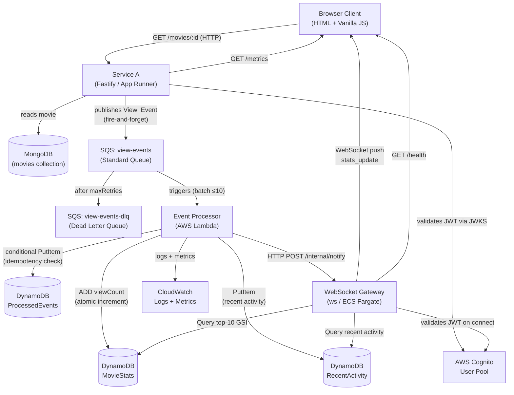
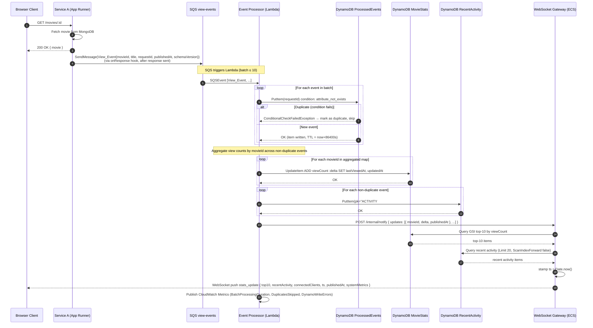

# Design Document — Realtime Analytics Dashboard

## Overview

The Realtime Analytics Dashboard is a cloud-native distributed system that captures movie-view events from a REST API, processes them asynchronously, persists aggregated statistics, and delivers live updates to browser clients over WebSocket.

The system is composed of four independently deployed components:

| Component | Runtime | Hosting |
|---|---|---|
| **Service A** (Fast Lazy Bee) | TypeScript / Fastify v5 | AWS App Runner |
| **Event Processor** | Node.js | AWS Lambda |
| **WebSocket Gateway** | Node.js / ws | AWS ECS Fargate |
| **Frontend** | HTML + Vanilla JS | Static (served by Gateway or S3) |

Supporting AWS services: SQS (two queues), DynamoDB (three tables), CloudWatch Logs/Metrics.

### Design Goals

- **Non-blocking API**: SQS publishing is fire-and-forget; it never delays the HTTP response.
- **Reliable processing**: SQS + Lambda retry semantics + DLQ guarantee at-least-once delivery with idempotency guards.
- **Real-time delivery**: WebSocket push from Gateway to all connected clients within 500 ms of a DynamoDB write.
- **Backpressure safety**: When event rate exceeds 100/s, the Gateway coalesces updates to at most 1 push/s per client.
- **End-to-end latency visibility**: `publishedAt` (epoch ms) stamped by the caller via `X-Requested-At`, carried through SQS to the Gateway; Gateway stamps `ts`, computes `latencyMs = ts - publishedAt`, maintains a rolling 60-second window, derives p50/p95/p99, and publishes them to CloudWatch. They reach the UI through the existing 5-second `GetMetricData` poll — durable across gateway restarts, zero browser-side calculations.

---

## Architecture

### Key Design Decisions

#### 1. SQS (not SNS or EventBridge) for Service A → Lambda decoupling

SQS Standard Queue is chosen because:

- **Buffering**: SQS decouples producer throughput from Lambda concurrency. If Lambda is throttled or cold-starting, messages queue up safely rather than being dropped.
- **At-least-once delivery with retries**: SQS retries failed messages up to the configured `maxReceiveCount` before routing to the DLQ, giving the Event Processor multiple chances to succeed.
- **Native Lambda trigger**: The SQS event source mapping handles polling, batching (up to 10 messages), and visibility-timeout management automatically — no custom polling loop needed.
- **Cost**: SQS is cheaper than EventBridge for high-volume, point-to-point fan-out to a single consumer. SNS would add unnecessary fan-out complexity for a single subscriber.
- **Ordering is not required**: Movie view events are independent; strict ordering per `movieId` is not needed because the DynamoDB `ADD` expression is commutative.

EventBridge would be appropriate if multiple downstream consumers needed to subscribe to the same event stream with content-based routing. That is not the case here.

#### 2. DynamoDB (not RDS) for statistics storage

- **Schema flexibility**: Aggregated counters and activity records have a simple key-value shape that maps naturally to DynamoDB items.
- **Atomic counters**: DynamoDB's `ADD` expression on a Number attribute is an atomic, server-side increment — no read-modify-write cycle, no optimistic locking needed for `viewCount`.
- **Serverless scaling**: `PAY_PER_REQUEST` billing mode scales read/write capacity automatically with zero capacity planning.
- **Low-latency reads**: Single-digit millisecond reads for the top-10 query via a GSI on `viewCount`.
- **TTL support**: Native TTL on the `ProcessedEvents` table automatically expires idempotency records after 24 hours with no application-level cleanup.

RDS would add operational overhead (VPC, subnet groups, connection pooling, patching) and would not provide atomic increment semantics without explicit transactions.

#### 3. Idempotency via ProcessedEvents table with TTL

Each View_Event carries a `requestId` (UUID v4). Before writing to `MovieStats`, the Event Processor performs a conditional `PutItem` on `ProcessedEvents` with `attribute_not_exists(requestId)`. If the condition fails, the event is a duplicate and is skipped. The TTL attribute is set to `now + 86400s` so records expire automatically after 24 hours, keeping the table small.

This approach is safe under SQS at-least-once delivery: a message redelivered within 24 hours will be detected and skipped.

#### 4. Lambda → Gateway notification: direct HTTP POST (not a second SQS queue)

After writing to DynamoDB, the Event Processor notifies the WebSocket Gateway via an **HTTP POST** to the Gateway's internal `/internal/notify` endpoint (not exposed publicly).

Rationale:
- **Simplicity**: A second SQS queue would require the Gateway to run a polling loop, adding latency and operational complexity.
- **Latency**: Direct HTTP POST is synchronous and typically completes in < 10 ms on the same VPC, keeping the end-to-end latency budget well within 500 ms.
- **Acceptable coupling**: The Gateway URL is injected via environment variable (`GATEWAY_INTERNAL_URL`). Lambda retries the POST up to 2 times on failure; if all retries fail, the push is skipped for that event (the next event will carry fresh stats).
- **No ordering requirement**: Because the Gateway always queries DynamoDB for the latest top-10 before pushing, out-of-order or dropped notifications are self-healing — the next successful notification will carry the correct current state.

A second SQS queue would be preferred if the Gateway needed to be horizontally scaled across multiple instances without a shared in-process connection store. For the current single-instance deployment, direct HTTP is simpler and faster.

#### 5. Backpressure: throttle to 1 push/second per client

When the incoming notification rate exceeds 100 events/second, the Gateway activates backpressure mode. In this mode, a per-client timer coalesces all pending updates into a single `stats_update` message sent at most once per second. This prevents WebSocket frame flooding on slow clients and keeps CPU usage bounded.

#### 6. End-to-end latency tracking

- `publishedAt`: epoch ms stamped by the **caller** (browser or Artillery) in the `X-Requested-At` request header. Service A reads this and passes it as `publishedAt` in the SQS message. If the header is absent, Service A falls back to `Date.now()`.
- `ts`: epoch ms stamped by the **Gateway** immediately before sending each `stats_update` — this is the delivery timestamp.
- The **Gateway** computes `latencyMs = ts - publishedAt` on each `/internal/notify`, maintains a rolling 60-second window of samples, derives p50/p95/p99 server-side, and publishes them to CloudWatch as `EndToEndLatencyP50`, `EndToEndLatencyP95`, `EndToEndLatencyP99` under the `AnalyticsDashboard` namespace.
- These percentiles flow back to the UI through the existing 5-second `GetMetricData` poll, arriving in `systemMetrics.gateway` alongside `connectedClients`, `viewEventsPerSecond`, and `backpressureActive`. The browser does **no latency calculations** — it only renders what it receives.
- **Durability**: because the percentiles live in CloudWatch (not in-memory), a gateway restart does not lose latency history. On restart, the `GetMetricData` poll immediately recovers the last hour of data and the `initial_state` sent to reconnecting clients is complete.

> **Bonus (if time permits):** Full round-trip `latency_ack` — browser stamps `receivedAt` on receiving the push and sends it back to the Gateway. Gateway computes `fullLatencyMs = receivedAt - publishedAt` and publishes it as a separate CloudWatch metric `FullRoundTripLatency`.

### Cost Protection

The following cost guardrails are provisioned via CDK (Req 14):

- **AWS Budget alert**: Email notification when monthly spend exceeds $10.
- **Lambda max concurrency**: Event_Processor reserved concurrency capped at 10 to prevent DynamoDB flooding during traffic spikes.
- **DynamoDB on-demand with write cap**: All tables use `PAY_PER_REQUEST` with a provisioned write capacity upper bound to cap costs during load testing.
- **Teardown**: All ECS Fargate and App Runner services are torn down via `cdk destroy` after the presentation.

> **Bonus (if time permits):** AWS WAF on App Runner with rate limiting (100 req/min per IP) and an IP allowlist exempting the load testing EC2 instance.

### Component Diagram



### Sequence Diagram — Main Flow



---

## Components and Interfaces

### Service A — View Event Publisher

**Language & framework**: TypeScript, Fastify v5, `@fastify/autoload` for plugins and routes.

**Responsibilities**: Serve movie data from MongoDB; publish View_Events to SQS asynchronously.

**Endpoints**:

| Method | Path | Description |
|---|---|---|
| `GET` | `/api/v1/movies/:movie_id` | Returns movie JSON; publishes View_Event to SQS (fire-and-forget) |
| `GET` | `/api/v1/metrics` | Returns JSON with `totalPublished`, `publishErrors`, `avgPublishLatencyMs` |

> Note: The route parameter is `movie_id` (underscore), matching the existing `API_ENDPOINTS.MOVIE = '/movies/:movie_id'` constant and the handler in `src/routes/movies/movie_id/movie-id-routes.ts`.

**File structure** (additions to the existing codebase):

```
service-a/src/
├── plugins/
│   └── sqs.ts                  # Fastify plugin: registers SQS client + metrics counters
│                               # decorated onto the instance as fastify.sqsPublisher
│   └── cognito-auth.ts         # Fastify plugin: registers @fastify/jwt with Cognito JWKS endpoint
├── routes/
│   └── metrics/
│       └── metrics-routes.ts   # GET /metrics handler (autoloaded)
│   └── movies/
│       └── movie_id/
│           └── movie-id-routes.ts  # MODIFIED: onResponse hook publish after fetchMovie()
└── schemas/
    └── dotenv.ts               # MODIFIED: add SQS_QUEUE_URL, AWS_REGION, COGNITO_JWKS_URL fields
```

**SQS plugin** (`src/plugins/sqs.ts`):
- Implemented as a `fastify-plugin` (`fp`) decorated onto the Fastify instance as `fastify.sqsPublisher`.
- Initialises an `@aws-sdk/client-sqs` `SQSClient` using `AWS_REGION` from `fastify.config`.
- Exposes a `publish(event: ViewEvent): void` method that calls `sqs.send(new SendMessageCommand(...))` without `await` (fire-and-forget).
- Maintains in-memory counters `totalPublished`, `publishErrors`, `totalPublishLatencyMs` for the `/metrics` endpoint.
- Declared dependency: `['server-config']` so `fastify.config` is available.

**Integration point in `movie-id-routes.ts`**:
The `fetchMovie` handler already calls `this.dataStore.fetchMovie(params.movie_id)`, which throws a 404 via `genNotFoundError` when the movie is not found. The SQS publish is registered as an `onResponse` hook so it fires **after** the HTTP response is sent to the client. This guarantees the response is never delayed by the SQS call, and only 2xx responses trigger a publish (Req 1.5).

```typescript
// In movie-id-routes.ts — register a Fastify onResponse hook on the route
fastify.addHook('onResponse', async (request, reply) => {
  if (reply.statusCode >= 200 && reply.statusCode < 300) {
    const movie = (reply as any).locals?.movie;
    if (movie) {
      this.sqsPublisher.publish({
        schemaVersion: '1.0',
        requestId: crypto.randomUUID(),
        movieId: request.params.movie_id,
        title: movie.title,
        publishedAt: Number(request.headers['x-requested-at']) || Date.now()
      });
    }
  }
});
```

> **Implementation note**: The current code snippet uses `reply.raw.on('finish', ...)` which bypasses Fastify's hook lifecycle and won't benefit from Fastify's error handling. The correct approach is to use Fastify's built-in `onResponse` hook via `fastify.addHook('onResponse', handler)` (registered at route or plugin scope). This fires after the response is fully sent, is properly managed by Fastify's lifecycle, and handles errors consistently. The movie object should be stashed on `reply.locals` (or equivalent) by the handler before calling `reply.send()` so the hook can access it.

This placement ensures:
- 404 responses (movie not found) never trigger a publish — `genNotFoundError` throws before `reply.send()` is called, so `onResponse` never fires for error paths.
- The HTTP response is never delayed by the SQS call — `onResponse` fires after the response is fully sent.

**Environment variables** (added to `src/schemas/dotenv.ts` TypeBox schema):

```typescript
SQS_QUEUE_URL:      Type.String(),   // required — no default
AWS_REGION:         Type.String({ default: 'us-east-1' }),
COGNITO_JWKS_URL:   Type.String()    // required — Cognito User Pool JWKS endpoint for JWT validation
```

These are read via `fastify.config.SQS_QUEUE_URL`, `fastify.config.AWS_REGION`, and `fastify.config.COGNITO_JWKS_URL` after `@fastify/env` validates them at startup. No secrets are hardcoded; values are injected at runtime via App Runner configuration environment variables.

**CloudWatch metrics** (Req 15): Service A publishes the following custom metrics to CloudWatch under the `AnalyticsDashboard` namespace via `PutMetricData`. The Service A IAM role must include `cloudwatch:PutMetricData`.
- `GetMovieInvocations` — count of `GET /movies/:id` requests per interval
- `SqsPublishErrors` — count of failed SQS publish attempts per interval
- `SqsPublishLatency` — time taken to publish each View_Event to SQS (ms)

**Container image**: The Service A Docker image is built and pushed to **AWS ECR**. The App Runner service is configured to pull from ECR. Environment variables (SQS URL, MongoDB URL, Cognito config) are injected at runtime via App Runner environment configuration — no secrets hardcoded in the image.

**Dockerfile** (multi-stage TypeScript build):

```dockerfile
# Stage 1: build
FROM node:22-alpine AS builder
WORKDIR /app
COPY package*.json ./
RUN npm ci
COPY . .
RUN npm run build          # runs: rimraf dist && tsc -p tsconfig.json

# Stage 2: runtime
FROM node:22-alpine
WORKDIR /app
COPY package*.json ./
RUN npm ci --omit=dev
COPY --from=builder /app/dist ./dist
EXPOSE 3000
CMD ["node", "dist/src/server.js"]
```

Default port is **3000** (`APP_PORT=3000` in `.env.sample`; the Docker host port 3042 is a separate mapping in `docker-compose.yml`).

---

### Event Processor — Lambda Function

**Responsibilities**: Consume SQS batches; enforce idempotency; atomically increment view counts; notify Gateway.

**Trigger**: SQS event source mapping on `view-events` queue, batch size 10, `FunctionResponseTypes: [ReportBatchItemFailures]`.

**Processing logic (per batch)**:
1. Parse all `View_Event` records from the SQS batch.
2. For each event, perform a conditional `PutItem` on `ProcessedEvents` with `ConditionExpression: attribute_not_exists(requestId)`.
   - If `ConditionalCheckFailedException` → mark as duplicate, skip from aggregation.
   - **Ordering note**: idempotency checks run first across all events before any aggregation begins. This ensures that if the same `requestId` appears multiple times within a single batch (SQS can redeliver within a batch), only the first occurrence passes the condition — the rest are marked as duplicates and excluded from the aggregated delta. Aggregation only operates on the confirmed-new set.
3. Aggregate view counts by `movieId` across all non-duplicate events in the batch (e.g. 3 events for movie A + 2 for movie B → `{ "movieA": 3, "movieB": 2 }`).
4. For each `movieId` in the aggregated map, perform one `UpdateItem` on `MovieStats`: `ADD viewCount :delta SET lastViewedAt = :ts, updatedAt = :now` where `:delta` is the aggregated count.
5. For each non-duplicate event, `PutItem` on `RecentActivity`: `{ pk: "ACTIVITY#<YYYY-MM-DD>", viewedAt: publishedAt, movieId, title, ttl: Math.floor(Date.now()/1000) + 86400 }` where the date is the UTC date at processing time.
6. After all writes succeed, send ONE HTTP POST notification to the Gateway with the aggregated results: `POST /internal/notify { updates: [{ movieId, delta, publishedAt }, ...] }` — includes `X-Internal-Secret` header. This single notification is sent once per batch, not once per event.
7. Emit CloudWatch Metrics: `BatchProcessingDuration` (ms), `DuplicatesSkipped` (count), `DynamoWriteErrors` (count).

**Batch failure handling**: Use `ReportBatchItemFailures` — return failed `itemIdentifier`s so SQS only retries failed messages, not the whole batch.

**Environment variables**: `DYNAMODB_TABLE_STATS`, `DYNAMODB_TABLE_EVENTS`, `DYNAMODB_TABLE_RECENT_ACTIVITY`, `GATEWAY_INTERNAL_URL`, `INTERNAL_SECRET`, `AWS_REGION`, `SQS_BATCH_SIZE` (default 10 — controls the SQS event source mapping batch size without redeployment).

---

### WebSocket Gateway

**Responsibilities**: Maintain WebSocket connections; receive Lambda notifications; query DynamoDB; push `stats_update` to all clients; apply backpressure; poll CloudWatch for system metrics; validate Cognito JWTs on connect.

**Endpoints**:

| Protocol | Path | Description |
|---|---|---|
| WebSocket | `/ws` | Client connection endpoint (JWT required) |
| HTTP GET | `/health` | Returns `{ status, connectedClients, backpressureActive }` |
| HTTP POST | `/internal/notify` | Receives notification from Lambda (internal port 8081, protected by `X-Internal-Secret` header) |

**Connection lifecycle**:
- `onopen`: Validate Cognito JWT (reject with 401 if invalid); add client to `connections` Map; query DynamoDB top-10 and RecentActivity; send `initial_state` message (includes `recentActivity`, `systemMetrics.history` with latency percentiles embedded in `gateway` field); broadcast updated `connectedClients` count.
- `onclose` / `onerror`: Remove client from `connections`; broadcast updated `connectedClients` count.

**Ping/pong keepalive**: Every 30 seconds the Gateway sends a WebSocket ping frame to all connected clients. Clients that do not respond with a pong within the next ping interval are removed from the active set. This keeps connections alive through the ALB idle timeout.

**Notification handling** (`POST /internal/notify`):
1. Validate `X-Internal-Secret` header — return HTTP 403 if missing or incorrect.
2. Receive `{ updates: [{ movieId, delta, publishedAt }, ...] }` — one entry per unique `movieId` in the processed batch.
3. Use the `publishedAt` from the earliest event in the batch for end-to-end latency calculation.
4. If backpressure is active (event rate > 100/s): enqueue update; coalesced push fires at most 1/s per client.
5. Otherwise: serve top-10 and RecentActivity from in-memory cache (see below); stamp `ts = Date.now()`; compute `latencyMs = ts - publishedAt`; update rolling 60s latency window; compute p50/p95/p99; store latest percentiles in memory for the next scheduled `PutMetricData` flush; attach latest `systemMetrics` data point; broadcast ONE `stats_update` to all clients.

**CloudWatch latency metrics flush**:
The Gateway does NOT call `PutMetricData` on every `/internal/notify`. Instead, a separate 30-second interval timer flushes the latest computed p50/p95/p99 values to CloudWatch as `EndToEndLatencyP50`, `EndToEndLatencyP95`, `EndToEndLatencyP99`. This avoids paying for ~20 redundant `PutMetricData` calls per second under load (CloudWatch standard resolution has 1-second minimum granularity anyway, so per-notify calls would just overwrite the same bucket). The 30-second flush interval is configurable via `CLOUDWATCH_METRICS_FLUSH_INTERVAL_MS` (default 30000).

**Top-10 and RecentActivity cache**:
The Gateway maintains an in-memory cache of the last DynamoDB query results for top-10 (`MovieStats` GSI) and recent activity (`RecentActivity`). The cache is invalidated and refreshed on each `/internal/notify` call, but the DynamoDB queries run asynchronously — the previous cached result is broadcast immediately while the refresh happens in the background. This keeps the notify → broadcast path off the DynamoDB read latency critical path.

> **Design note**: Without caching, every `/internal/notify` call triggers two synchronous DynamoDB reads before broadcasting. Under load testing (200 req/s → batches firing every ~50ms) this puts DynamoDB reads directly on the broadcast critical path and risks exceeding the 500ms delivery budget. A 1-second TTL cache (or stale-while-revalidate pattern) keeps broadcasts fast while keeping data fresh enough for a real-time dashboard.

**CloudWatch metrics polling**:
- On startup, the Gateway starts a polling loop that calls `GetMetricData` every `CLOUDWATCH_POLL_INTERVAL_MS` (default 5000 ms).
- The poll fetches all metrics under the `AnalyticsDashboard` namespace plus AWS-native metrics (Lambda invocations/errors/duration, SQS queue depth, ECS CPU%/memory%).
- Each poll result is appended to an in-memory rolling 1-hour buffer (max 720 data points at 5s granularity).
- The latest data point is attached to every `stats_update` as `systemMetrics` (single object).
- The full buffer is sent in `initial_state` as `systemMetrics.history` (array of up to 720 objects).

**Backpressure implementation**:
- Maintain a sliding-window event counter (1-second window).
- If counter > 100: set `backpressureActive = true`; start a 1-second interval timer that drains the pending update queue.
- If counter drops ≤ 100 for 3 consecutive seconds: set `backpressureActive = false`; cancel timer.

**Environment variables**: `DYNAMODB_TABLE_STATS`, `DYNAMODB_TABLE_RECENT_ACTIVITY`, `AWS_REGION`, `PORT` (default 8080), `INTERNAL_PORT` (default 8081), `COGNITO_JWKS_URL`, `INTERNAL_SECRET`, `CLOUDWATCH_POLL_INTERVAL_MS` (default 5000), `CLOUDWATCH_METRICS_FLUSH_INTERVAL_MS` (default 30000).

---

### Frontend — Single-Page Dashboard

**Responsibilities**: Connect to WebSocket Gateway; render live statistics; handle reconnection; display latency percentile chart.

**WebSocket message types received**:

| Type | Payload | Action |
|---|---|---|
| `initial_state` | `{ top10, recentActivity, connectedClients, ts, systemMetrics }` | Full dashboard refresh |
| `stats_update` | `{ top10, recentActivity, connectedClients, ts, systemMetrics }` | Incremental update — append data points and re-render |

**Reconnection strategy**: Exponential backoff starting at 1000 ms, multiplier 2, cap 30 000 ms, max 10 attempts. Display "Reconnecting..." during attempts; display "Connection lost. Please refresh the page." after 10 failures.

**Chart inventory**:

**Analytics Section (required):**
- Top 10 most viewed movies — scrollable ranked list rendered as `"#1 <title> — <viewCount> views"`
- Recent activity feed — scrollable list rendered as `"<title> — <timestamp>"`
- Connected users count — single large number display

**Latency chart**:
- Latency percentiles (p50/p95/p99) arrive in `systemMetrics.gateway.latencyP50/P95/P99` via the 5-second CloudWatch poll — no browser-side calculations.
- Append `{ ts, latencyP50, latencyP95, latencyP99 }` to the local `latencyHistory` array on each `stats_update`.
- Render as a multi-line Chart.js chart (time on x-axis, ms on y-axis, 3 lines).

> **Bonus (if time permits):** On receiving each `stats_update`, stamp `receivedAt = Date.now()` and send `{ type: "latency_ack", publishedAt, receivedAt }` back to the Gateway for full round-trip CloudWatch metrics.
- Throughput (view events/second) — line chart; data from `systemMetrics.gateway.viewEventsPerSecond`

**Service A Section (bonus):**
- `GET /movies/:id` invocations/sec — line chart; data from `systemMetrics.serviceA` (via CloudWatch `GetMovieInvocations`)
- SQS publish latency — line chart; data from CloudWatch `SqsPublishLatency`
- SQS publish errors — line chart; data from CloudWatch `SqsPublishErrors`

**Lambda Section (bonus):**
- Invocations/sec, batch processing duration, error rate, duplicates skipped — line charts; data from `systemMetrics.lambda`

**SQS Section (bonus):**
- Queue depth over time, messages sent/deleted — line charts; data from `systemMetrics.sqs`

**Gateway Section (bonus):**
- Connected clients over time — line chart; data from `systemMetrics.gateway.connectedClients`
- Backpressure state — colored indicator (green = inactive, red = active); data from `systemMetrics.gateway.backpressureActive`

**ECS Section (bonus):**
- CPU% and memory% over time — line charts; data from `systemMetrics.serviceA.cpuPercent` / `memoryPercent`

All time-series charts use `ts` (epoch ms) on the x-axis. The UI appends data points to local history arrays and re-renders — no client-side calculations.

---

## Data Models

### DynamoDB: `MovieStats` Table

**Billing**: `PAY_PER_REQUEST`

| Attribute | Type | Description |
|---|---|---|
| `movieId` | String (PK) | Unique movie identifier |
| `title` | String | Movie title (denormalized for GSI projection) |
| `viewCount` | Number | Total view count (atomically incremented) |
| `lastViewedAt` | Number | Epoch ms of most recent view |
| `updatedAt` | Number | Epoch ms of last DynamoDB write |

**Global Secondary Index: `viewCount-index`**

| Attribute | Role |
|---|---|
| `viewCount` | Sort key (descending) |

Used by the Gateway to query the top-10 movies efficiently. Projection: `ALL`.

> Note: Because DynamoDB GSIs do not support a "scan all, sort by X" query natively, the Gateway uses a `Scan` with a `Limit` on the GSI, or maintains a fixed partition key (e.g., `pk = "GLOBAL"`) to enable a `Query` with `ScanIndexForward: false`. The recommended approach is a **sparse GSI** with a fixed `pk = "STATS"` attribute on every item, enabling a `Query` sorted by `viewCount` descending.

**Revised `MovieStats` item shape** (with sparse GSI support):

```json
{
  "movieId":      "tt0111161",
  "title":        "The Shawshank Redemption",
  "pk":           "STATS",
  "viewCount":    4821,
  "lastViewedAt": 1745678901234,
  "updatedAt":    1745678901300
}
```

GSI: partition key `pk` (String), sort key `viewCount` (Number), `ScanIndexForward: false`, `Limit: 10`.

---

### DynamoDB: `ProcessedEvents` Table

**Billing**: `PAY_PER_REQUEST`

| Attribute | Type | Description |
|---|---|---|
| `requestId` | String (PK) | UUID v4 from View_Event |
| `movieId` | String | Movie that was viewed |
| `processedAt` | Number | Epoch ms of processing |
| `ttl` | Number | Unix epoch seconds; DynamoDB TTL attribute (now + 86400) |

No GSI required. Access pattern is always a single-key lookup by `requestId`.

---

### DynamoDB: `RecentActivity` Table

**Billing**: `PAY_PER_REQUEST`

| Attribute | Type | Description |
|---|---|---|
| `pk` | String (PK) | Day-scoped partition key, format `"ACTIVITY#YYYY-MM-DD"` (e.g. `"ACTIVITY#2025-04-26"`) |
| `viewedAt` | Number (SK) | Epoch ms — equals `publishedAt` from the View_Event |
| `movieId` | String | Movie that was viewed |
| `title` | String | Movie title |
| `ttl` | Number | Unix epoch seconds; DynamoDB TTL attribute (`Math.floor(Date.now()/1000) + 86400`) |

Query pattern: `pk = "ACTIVITY#<today>"`, `ScanIndexForward: false`, `Limit: 20` — returns the 20 most recent view events for today sorted newest-first.

> **Design note**: Using a fixed `pk = "ACTIVITY"` for all events creates a hot partition — all writes and reads hit the same DynamoDB partition, which becomes a bottleneck under load testing at 200 req/s. Appending the date (`ACTIVITY#YYYY-MM-DD`) distributes writes across daily partitions and keeps each partition's data naturally bounded by the 1-day TTL. The gateway queries today's partition for the activity feed; the TTL handles cleanup automatically.

---

### SQS Message: `View_Event`

```json
{
  "schemaVersion": "1.0",
  "requestId":     "550e8400-e29b-41d4-a716-446655440000",
  "movieId":       "tt0111161",
  "title":         "The Shawshank Redemption",
  "publishedAt":   1745678901234
}
```

---

### WebSocket Message: `stats_update`

```json
{
  "type": "stats_update",
  "ts":           1745678901234,
  "connectedClients": 12,
  "top10": [
    { "movieId": "tt0111161", "title": "The Shawshank Redemption", "viewCount": 4821 },
    { "movieId": "tt0068646", "title": "The Godfather", "viewCount": 3102 }
  ],
  "recentActivity": [
    { "movieId": "tt0111161", "title": "The Shawshank Redemption", "viewedAt": 1745678901000 }
  ],
  "systemMetrics": {
    "ts": 1745678901234,
    "lambda": { "invocations": 46, "errors": 0, "avgDurationMs": 182 },
    "sqs": { "queueDepth": 0, "messagesSent": 46 },
    "serviceA": { "cpuPercent": 13, "memoryPercent": 34 },
    "gateway": { "connectedClients": 3, "viewEventsPerSecond": 9, "backpressureActive": false, "latencyP50": 122, "latencyP95": 345, "latencyP99": 590 }
  }
}
```

> `stats_update` contains only the latest single data point for `systemMetrics` (not history). The UI appends it to its local history array. `top10` always contains exactly 10 items (or fewer only if less than 10 movies have been viewed).

---

### WebSocket Message: `initial_state`

```json
{
  "type": "initial_state",
  "ts": 1745678901234,
  "connectedClients": 12,
  "top10": [
    { "movieId": "tt0111161", "title": "The Shawshank Redemption", "viewCount": 4821 }
  ],
  "recentActivity": [
    { "movieId": "tt0111161", "title": "The Shawshank Redemption", "viewedAt": 1745678901000 }
  ],
  "systemMetrics": {
    "history": [
      {
        "ts": 1745678900000,
        "lambda": { "invocations": 45, "errors": 0, "avgDurationMs": 180 },
        "sqs": { "queueDepth": 2, "messagesSent": 45 },
        "serviceA": { "cpuPercent": 12, "memoryPercent": 34 },
        "gateway": { "connectedClients": 3, "viewEventsPerSecond": 8, "backpressureActive": false, "latencyP50": 120, "latencyP95": 340, "latencyP99": 580 }
      }
    ]
  }
}
```

> `systemMetrics.history` contains up to 720 data points (last 1 hour at 5s granularity) for chart initialisation.

---

### WebSocket Message: `latency_ack` (browser → gateway, bonus)

```json
{
  "type": "latency_ack",
  "publishedAt": 1745678900900,
  "receivedAt":  1745678901350
}
```

> Sent by the browser immediately upon receiving a `stats_update`. The Gateway uses `fullLatencyMs = receivedAt - publishedAt` to recompute p50/p95/p99 from full round-trip samples.

---

## Authentication (Cognito)

The system uses **AWS Cognito User Pool** as the identity provider for all user-facing access.

### Flow

1. **Dashboard login**: On first load, the Dashboard redirects to the Cognito hosted UI. After successful login, Cognito returns a JWT (ID token).
2. **JWT storage**: The Dashboard stores the JWT in memory (not localStorage) and attaches it as `Authorization: Bearer <token>` on every `GET /movies/:id` HTTP request to Service A.
3. **Service A validation**: Service A validates the Cognito JWT on all incoming requests using `@fastify/jwt` configured with the Cognito User Pool's public JWKS endpoint (`COGNITO_JWKS_URL`). Requests without a valid token receive HTTP 401.
4. **WebSocket authentication**: The Dashboard attaches the JWT as a query parameter or `Authorization` header when establishing the WebSocket connection. The Gateway validates the token on connect using `@fastify/jwt` with the same JWKS endpoint and rejects unauthenticated connections.
5. **Load testing**: A dedicated Cognito user (`loadtest@project.com`) is used. A fresh JWT is obtained before each test run via `aws cognito-idp initiate-auth` and injected as `LOAD_TEST_TOKEN`.

### Infrastructure

- Cognito User Pool and app client are provisioned via CDK.
- User accounts are created manually after `cdk deploy` — never hardcoded in CDK or committed to git.

---

## Correctness Properties

*A property is a characteristic or behavior that should hold true across all valid executions of a system — essentially, a formal statement about what the system should do. Properties serve as the bridge between human-readable specifications and machine-verifiable correctness guarantees.*

### Property 1: Counter Invariant

*For any* sequence of N View_Events with distinct `requestId` values and the same `movieId`, after all events are processed the `viewCount` for that `movieId` in `MovieStats` SHALL equal N.

**Validates: Requirements 3.3, 4.2**

---

### Property 2: Idempotency

*For any* set of View_Events where multiple events share the same `requestId`, processing the entire set SHALL produce the same final `viewCount` as processing the event exactly once.

**Validates: Requirements 11.2, 11.3, 11.5**

---

### Property 3: Movie Isolation

*For any* pair of View_Events with different `movieId` values, processing one event SHALL leave the `viewCount` of the other `movieId` unchanged.

**Validates: Requirements 4.3**

---

### Property 4: Serialization Round-Trip

*For any* valid `View_Event` object, serializing it to JSON (as published to SQS by Service A) and then deserializing it (as consumed by Event Processor) SHALL yield an object with identical field values (`schemaVersion`, `requestId`, `movieId`, `title`, `publishedAt`).

**Validates: Requirements 1.2**

---

### Property 5: Monotonically Non-Decreasing View Counts

*For any* sequence of `stats_update` messages received by a connected client for the same `movieId`, the `viewCount` values SHALL be monotonically non-decreasing — a counter pushed to the client SHALL never be lower than a previously pushed counter for the same movie.

**Validates: Requirements 3.3, 4.2**

---

### Property 6: Whitespace / Invalid Input Rejection

*For any* SQS message body that is not valid JSON or is missing required fields (`movieId`, `requestId`, `publishedAt`), Event Processor SHALL reject the message without writing to DynamoDB and SHALL route it to the DLQ after exhausting retries.

**Validates: Requirements 2.3**

---

### Property 7: Backpressure Coalescing

*For any* burst of N notification events arriving at the Gateway within a 1-second window when backpressure is active (N > 100), each connected client SHALL receive exactly one `stats_update` message during that window (not N messages).

**Validates: Requirements 12.3**

---

## Error Handling

### Service A

| Scenario | Behavior |
|---|---|
| MongoDB unavailable | Return HTTP 503; do not publish View_Event |
| Movie not found | Return HTTP 404; do not publish View_Event |
| SQS publish fails | Log `ERROR` with `movieId` + `requestId`; increment `publishErrors`; return normal HTTP response to client |
| SQS publish timeout | Same as publish failure; use a 200 ms client-side timeout on the SQS call |

### Event Processor (Lambda)

| Scenario | Behavior |
|---|---|
| Malformed JSON in SQS message | Log `ERROR`; mark item as failed in `ReportBatchItemFailures`; SQS retries up to `maxReceiveCount` then routes to DLQ |
| DynamoDB `ProcessedEvents` write fails | Retry (Lambda retry semantics); if persistent, fail the item → DLQ |
| DynamoDB `MovieStats` write fails | Retry; if persistent, fail the item → DLQ |
| Gateway HTTP POST fails | Log `WARN`; do not fail the SQS message (stats are already written; next notification will carry fresh data) |
| Lambda timeout (> 30 s) | SQS makes message visible again; Lambda retries up to `maxReceiveCount` |

### WebSocket Gateway

| Scenario | Behavior |
|---|---|
| JWT missing or invalid on WebSocket connect | Reject connection with HTTP 401 |
| `X-Internal-Secret` header missing or wrong on `/internal/notify` | Return HTTP 403; log `WARN` |
| DynamoDB query fails on `/internal/notify` | Log `ERROR`; skip push for this notification cycle |
| Client WebSocket send fails | Remove client from `connections`; log `WARN` |
| End-to-end latency > 2000 ms | Log `WARN` with `movieId` and measured latency |
| `/internal/notify` called with invalid payload | Return HTTP 400; log `WARN` |
| Client fails to respond to ping with pong | Remove client from `connections` on next ping cycle |

### Frontend

| Scenario | Behavior |
|---|---|
| WebSocket `onclose` / `onerror` | Start exponential backoff reconnection |
| > 10 reconnection failures | Display "Connection lost. Please refresh the page."; stop retrying |
| `stats_update` missing `systemMetrics` field | Skip system metrics chart update; still update top-10 and activity feed |
| Malformed JSON from Gateway | Log to console; ignore message |

---

## Testing Strategy

### Unit Tests

Each component has isolated unit tests covering:

- **Service A**: SQS publish logic (mock SQS client), error handling when SQS fails, metrics counter increments, 404 path skips publish.
- **Event Processor**: Idempotency check (mock DynamoDB), atomic increment (mock DynamoDB), batch failure reporting, Gateway notification (mock HTTP).
- **WebSocket Gateway**: Connection lifecycle (mock ws), backpressure activation/deactivation, `stats_update` message construction, latency warning threshold.
- **Frontend**: Reconnection backoff timing, latency percentile calculation, DOM update on `stats_update`.

### Service A Test Setup

Service A uses **Jest** with **Babel** (`@babel/preset-typescript`) for transpilation — not `ts-jest`. The `jest.config.ts` does not specify a `transform`, so Babel picks up `babel.config.js` automatically. Tests live in `src/test/`.

**MongoDB in tests**: The `mongodb.ts` plugin checks `fastify.config.NODE_ENV === 'test'` and switches to **Testcontainers** (`@testcontainers/mongodb`) instead of the real Atlas URL. The `mongodb-memory-server` package is also available as a lighter alternative for unit-level tests that don't need a real MongoDB wire protocol.

**Test server helper**: `src/utils/testing/test-server.ts` provides a pre-built Fastify instance with all plugins loaded, used across route tests in `src/test/routes/`.

**SQS mock pattern** (consistent with existing mock style in the codebase):

```typescript
// In test setup — mock the SQS plugin before building the test server
jest.mock('../plugins/sqs', () => ({
  default: fp(async (fastify) => {
    fastify.decorate('sqsPublisher', {
      publish: jest.fn(),
      getMetrics: jest.fn().mockReturnValue({ totalPublished: 0, publishErrors: 0 })
    });
  })
}));
```

**Coverage thresholds** (from `jest.config.ts`): branches 50%, functions 90%, lines 90%, statements 90%. New SQS plugin and metrics route code must meet these thresholds.

### Property-Based Tests

Property-based testing is applied to the pure logic layers of the Event Processor and the Frontend latency calculator. The chosen library is **[fast-check](https://github.com/dubzzz/fast-check)** (TypeScript/JavaScript).

Each property test runs a minimum of **100 iterations**.

Tag format: `// Feature: realtime-analytics-dashboard, Property <N>: <property_text>`

| Property | Component | Test approach |
|---|---|---|
| P1: Counter Invariant | Event Processor (mocked DynamoDB) | Generate N distinct events for same `movieId`; verify final count = N |
| P2: Idempotency | Event Processor (mocked DynamoDB) | Generate event; duplicate it K times; verify final count = 1 |
| P3: Movie Isolation | Event Processor (mocked DynamoDB) | Generate events for two random `movieId`s; verify counts are independent |
| P4: Serialization Round-Trip | Service A + Event Processor | Generate random `View_Event` objects (including `title`); serialize → deserialize; assert field equality |
| P5: Monotonically Non-Decreasing | Gateway push logic (mocked DynamoDB) | Generate sequence of view counts; verify each push ≥ previous push for same movie |
| P6: Invalid Input Rejection | Event Processor | Generate arbitrary malformed JSON strings; verify no DynamoDB write occurs |
| P7: Backpressure Coalescing | Gateway backpressure module | Generate N > 100 notifications in 1 s; verify each client receives exactly 1 push |

### Integration Tests

- End-to-end smoke test: publish a View_Event to SQS; wait up to 5 s; assert `MovieStats` `viewCount` incremented.
- WebSocket delivery test: connect a test client; trigger a view event; assert `stats_update` received within 500 ms.
- DLQ routing test: publish a malformed message; assert it appears in DLQ after `maxReceiveCount` retries.

### Performance / Load Tests

- Use [Artillery](https://www.artillery.io/) to simulate 200 concurrent `GET /api/v1/movies/:movie_id` requests/s for 60 s.
- Assert: p99 HTTP response latency < 200 ms; SQS publish error rate < 0.1%; WebSocket push latency p95 < 500 ms.
- Verify backpressure activates when rate > 100 events/s and clients receive ≤ 1 push/s.
