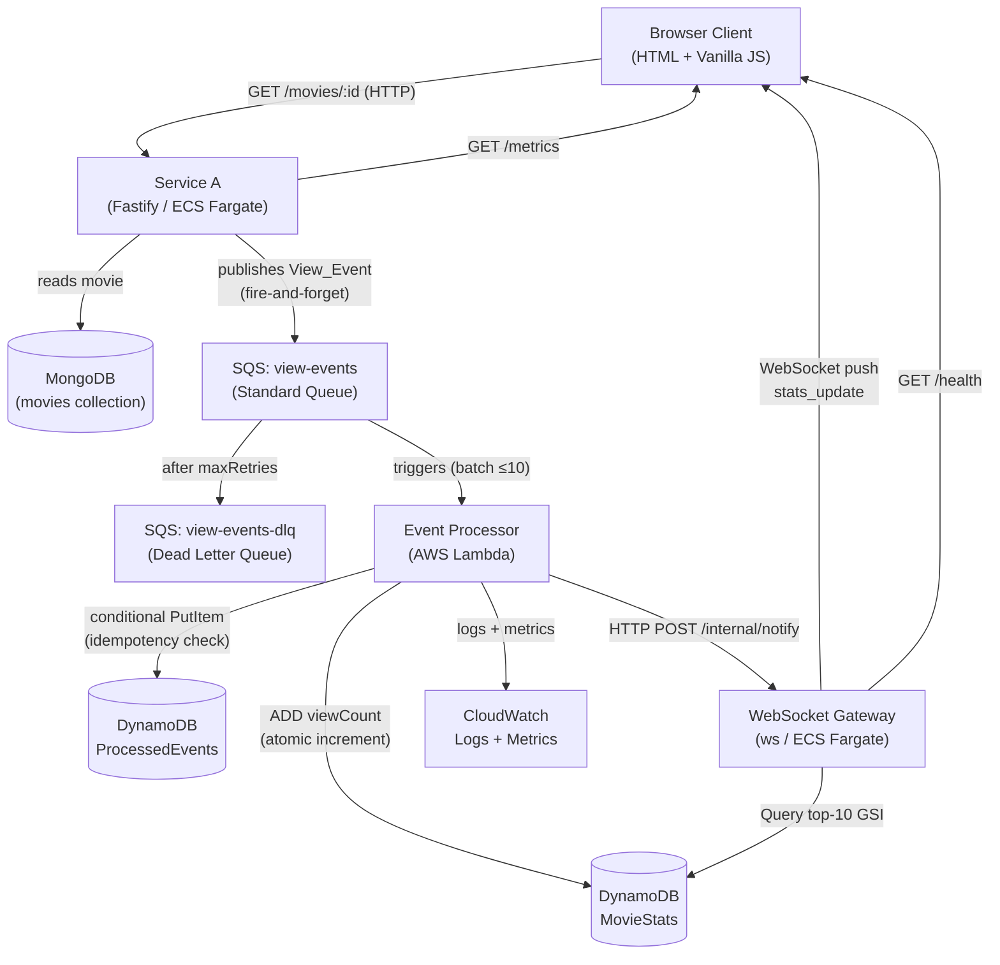
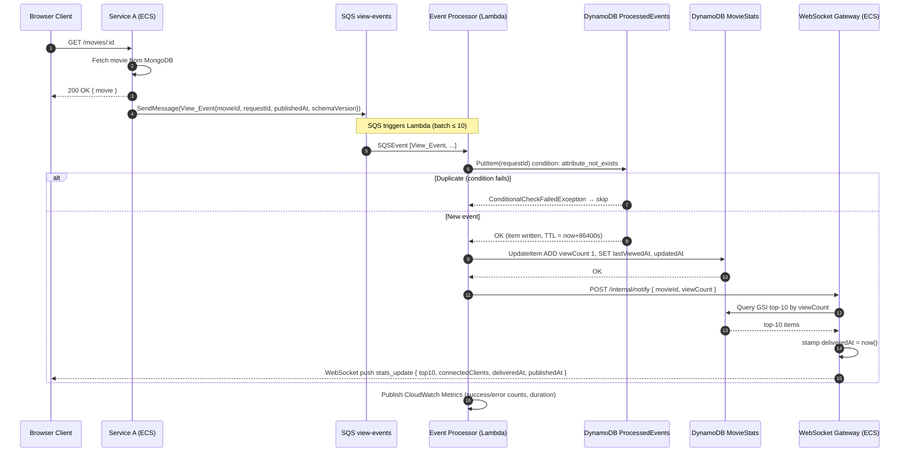

# Design Document — Realtime Analytics Dashboard

## Overview

The Realtime Analytics Dashboard is a cloud-native distributed system that captures movie-view events from a REST API, processes them asynchronously, persists aggregated statistics, and delivers live updates to browser clients over WebSocket.

The system is composed of four independently deployed components:

| Component | Runtime | Hosting |
|---|---|---|
| **Service A** (Fast Lazy Bee) | TypeScript / Fastify v5 | AWS ECS Fargate |
| **Event Processor** | Node.js | AWS Lambda |
| **WebSocket Gateway** | Node.js / ws | AWS ECS Fargate |
| **Frontend** | HTML + Vanilla JS | Static (served by Gateway or S3) |

Supporting AWS services: SQS (two queues), DynamoDB (two tables), CloudWatch Logs/Metrics.

### Design Goals

- **Non-blocking API**: SQS publishing is fire-and-forget; it never delays the HTTP response.
- **Reliable processing**: SQS + Lambda retry semantics + DLQ guarantee at-least-once delivery with idempotency guards.
- **Real-time delivery**: WebSocket push from Gateway to all connected clients within 500 ms of a DynamoDB write.
- **Backpressure safety**: When event rate exceeds 100/s, the Gateway coalesces updates to at most 1 push/s per client.
- **End-to-end latency visibility**: `publishedAt` timestamp embedded in every View_Event; Gateway stamps `deliveredAt` before each push; the frontend computes per-event latency and maintains p50/p95/p99 over a 60-second sliding window.

---

## Architecture

### Key Design Decisions

#### 1. SQS (not SNS or EventBridge) for Service A → Lambda decoupling

SQS Standard Queue is chosen because:

- **Buffering**: SQS decouples producer throughput from Lambda concurrency. If Lambda is throttled or cold-starting, messages queue up safely rather than being dropped.
- **At-least-once delivery with retries**: SQS retries failed messages up to the configured `maxReceiveCount` before routing to the DLQ, giving the Event Processor multiple chances to succeed.
- **Native Lambda trigger**: The SQS event source mapping handles polling, batching (up to 10 messages), and visibility-timeout management automatically — no custom polling loop needed.
- **Cost**: SQS is cheaper than EventBridge for high-volume, point-to-point fan-out to a single consumer. SNS would add unnecessary fan-out complexity for a single subscriber.
- **Ordering is not required**: Movie view events are independent; strict ordering per `movieId` is not needed because the DynamoDB `ADD` expression is commutative.

EventBridge would be appropriate if multiple downstream consumers needed to subscribe to the same event stream with content-based routing. That is not the case here.

#### 2. DynamoDB (not RDS) for statistics storage

- **Schema flexibility**: Aggregated counters and activity records have a simple key-value shape that maps naturally to DynamoDB items.
- **Atomic counters**: DynamoDB's `ADD` expression on a Number attribute is an atomic, server-side increment — no read-modify-write cycle, no optimistic locking needed for `viewCount`.
- **Serverless scaling**: `PAY_PER_REQUEST` billing mode scales read/write capacity automatically with zero capacity planning.
- **Low-latency reads**: Single-digit millisecond reads for the top-10 query via a GSI on `viewCount`.
- **TTL support**: Native TTL on the `ProcessedEvents` table automatically expires idempotency records after 24 hours with no application-level cleanup.

RDS would add operational overhead (VPC, subnet groups, connection pooling, patching) and would not provide atomic increment semantics without explicit transactions.

#### 3. Idempotency via ProcessedEvents table with TTL

Each View_Event carries a `requestId` (UUID v4). Before writing to `MovieStats`, the Event Processor performs a conditional `PutItem` on `ProcessedEvents` with `attribute_not_exists(requestId)`. If the condition fails, the event is a duplicate and is skipped. The TTL attribute is set to `now + 86400s` so records expire automatically after 24 hours, keeping the table small.

This approach is safe under SQS at-least-once delivery: a message redelivered within 24 hours will be detected and skipped.

#### 4. Lambda → Gateway notification: direct HTTP POST (not a second SQS queue)

After writing to DynamoDB, the Event Processor notifies the WebSocket Gateway via an **HTTP POST** to the Gateway's internal `/internal/notify` endpoint (not exposed publicly).

Rationale:
- **Simplicity**: A second SQS queue would require the Gateway to run a polling loop, adding latency and operational complexity.
- **Latency**: Direct HTTP POST is synchronous and typically completes in < 10 ms on the same VPC, keeping the end-to-end latency budget well within 500 ms.
- **Acceptable coupling**: The Gateway URL is injected via environment variable (`GATEWAY_INTERNAL_URL`). Lambda retries the POST up to 2 times on failure; if all retries fail, the push is skipped for that event (the next event will carry fresh stats).
- **No ordering requirement**: Because the Gateway always queries DynamoDB for the latest top-10 before pushing, out-of-order or dropped notifications are self-healing — the next successful notification will carry the correct current state.

A second SQS queue would be preferred if the Gateway needed to be horizontally scaled across multiple instances without a shared in-process connection store. For the current single-instance deployment, direct HTTP is simpler and faster.

#### 5. Backpressure: throttle to 1 push/second per client

When the incoming notification rate exceeds 100 events/second, the Gateway activates backpressure mode. In this mode, a per-client timer coalesces all pending updates into a single `stats_update` message sent at most once per second. This prevents WebSocket frame flooding on slow clients and keeps CPU usage bounded.

#### 6. End-to-end latency tracking

- `publishedAt`: ISO 8601 UTC timestamp added by Service A to every View_Event at the moment of SQS publish.
- `deliveredAt`: ISO 8601 UTC timestamp added by the Gateway to every `stats_update` message immediately before the WebSocket send.
- The frontend computes `latencyMs = Date.parse(deliveredAt) - Date.parse(publishedAt)` for each event and maintains a sorted array of samples within the last 60 seconds. p50/p95/p99 are derived from this array using index-based percentile selection.

### Component Diagram



### Sequence Diagram — Main Flow



---

## Components and Interfaces

### Service A — View Event Publisher

**Language & framework**: TypeScript, Fastify v5, `@fastify/autoload` for plugins and routes.

**Responsibilities**: Serve movie data from MongoDB; publish View_Events to SQS asynchronously.

**Endpoints**:

| Method | Path | Description |
|---|---|---|
| `GET` | `/api/v1/movies/:movie_id` | Returns movie JSON; publishes View_Event to SQS (fire-and-forget) |
| `GET` | `/api/v1/metrics` | Returns JSON with `totalPublished`, `publishErrors`, `avgPublishLatencyMs` |

> Note: The route parameter is `movie_id` (underscore), matching the existing `API_ENDPOINTS.MOVIE = '/movies/:movie_id'` constant and the handler in `src/routes/movies/movie_id/movie-id-routes.ts`.

**File structure** (additions to the existing codebase):

```
service-a/src/
├── plugins/
│   └── sqs.ts                  # Fastify plugin: registers SQS client + metrics counters
│                               # decorated onto the instance as fastify.sqsPublisher
├── routes/
│   └── metrics/
│       └── metrics-routes.ts   # GET /metrics handler (autoloaded)
│   └── movies/
│       └── movie_id/
│           └── movie-id-routes.ts  # MODIFIED: fire-and-forget publish after fetchMovie()
└── schemas/
    └── dotenv.ts               # MODIFIED: add SQS_QUEUE_URL, AWS_REGION fields
```

**SQS plugin** (`src/plugins/sqs.ts`):
- Implemented as a `fastify-plugin` (`fp`) decorated onto the Fastify instance as `fastify.sqsPublisher`.
- Initialises an `@aws-sdk/client-sqs` `SQSClient` using `AWS_REGION` from `fastify.config`.
- Exposes a `publish(event: ViewEvent): void` method that calls `sqs.send(new SendMessageCommand(...))` without `await` (fire-and-forget).
- Maintains in-memory counters `totalPublished`, `publishErrors`, `totalPublishLatencyMs` for the `/metrics` endpoint.
- Declared dependency: `['server-config']` so `fastify.config` is available.

**Integration point in `movie-id-routes.ts`**:
The `fetchMovie` handler already calls `this.dataStore.fetchMovie(params.movie_id)`, which throws a 404 via `genNotFoundError` when the movie is not found. The SQS publish is inserted **after** the successful `fetchMovie` call and **before** `reply.send()`, as a non-awaited call:

```typescript
// Inside the GET /movies/:movie_id handler, after fetchMovie succeeds:
const movie = await this.dataStore.fetchMovie(params.movie_id);
// fire-and-forget — does not delay the HTTP response
this.sqsPublisher.publish({
  schemaVersion: '1.0',
  requestId: crypto.randomUUID(),
  movieId: params.movie_id,
  publishedAt: new Date().toISOString()
});
reply.code(HttpStatusCodes.OK).send(movie);
```

This placement ensures:
- 404 responses (movie not found) never trigger a publish — `genNotFoundError` throws before the publish line is reached.
- The HTTP response is never delayed by the SQS call.

**Environment variables** (added to `src/schemas/dotenv.ts` TypeBox schema):

```typescript
SQS_QUEUE_URL: Type.String(),   // required — no default
AWS_REGION:    Type.String({ default: 'us-east-1' })
```

These are read via `fastify.config.SQS_QUEUE_URL` and `fastify.config.AWS_REGION` after `@fastify/env` validates them at startup. No secrets are hardcoded; values are injected at runtime via ECS Task Definition environment variables.

**Dockerfile** (multi-stage TypeScript build):

```dockerfile
# Stage 1: build
FROM node:22-alpine AS builder
WORKDIR /app
COPY package*.json ./
RUN npm ci
COPY . .
RUN npm run build          # runs: rimraf dist && tsc -p tsconfig.json

# Stage 2: runtime
FROM node:22-alpine
WORKDIR /app
COPY package*.json ./
RUN npm ci --omit=dev
COPY --from=builder /app/dist ./dist
EXPOSE 3000
CMD ["node", "dist/src/server.js"]
```

Default port is **3000** (`APP_PORT=3000` in `.env.sample`; the Docker host port 3042 is a separate mapping in `docker-compose.yml`).

---

### Event Processor — Lambda Function

**Responsibilities**: Consume SQS batches; enforce idempotency; atomically increment view counts; notify Gateway.

**Trigger**: SQS event source mapping on `view-events` queue, batch size 10, `FunctionResponseTypes: [ReportBatchItemFailures]`.

**Processing logic per event**:
1. Parse `View_Event` from SQS message body.
2. `PutItem` on `ProcessedEvents` with `ConditionExpression: attribute_not_exists(requestId)`.
   - If `ConditionalCheckFailedException` → skip (duplicate).
3. `UpdateItem` on `MovieStats`: `ADD viewCount :one SET lastViewedAt = :ts, updatedAt = :now`.
4. `POST /internal/notify` to Gateway with `{ movieId, viewCount, publishedAt }`.
5. Emit CloudWatch Metrics: `EventsProcessed` (count), `EventsFailed` (count), `EventProcessingDuration` (ms).

**Batch failure handling**: Use `ReportBatchItemFailures` — return failed `itemIdentifier`s so SQS only retries failed messages, not the whole batch.

**Environment variables**: `DYNAMODB_TABLE_STATS`, `DYNAMODB_TABLE_EVENTS`, `GATEWAY_INTERNAL_URL`, `AWS_REGION`.

---

### WebSocket Gateway

**Responsibilities**: Maintain WebSocket connections; receive Lambda notifications; query DynamoDB; push `stats_update` to all clients; apply backpressure.

**Endpoints**:

| Protocol | Path | Description |
|---|---|---|
| WebSocket | `/ws` | Client connection endpoint |
| HTTP GET | `/health` | Returns `{ status, connectedClients, backpressureActive }` |
| HTTP POST | `/internal/notify` | Receives notification from Lambda (internal, not public) |

**Connection lifecycle**:
- `onopen`: Add client to `connections` Map; query DynamoDB top-10; send `initial_state` message; broadcast updated `connectedClients` count.
- `onclose` / `onerror`: Remove client from `connections`; broadcast updated `connectedClients` count.

**Notification handling** (`POST /internal/notify`):
1. Receive `{ movieId, viewCount, publishedAt }`.
2. If backpressure is active (event rate > 100/s): enqueue update; coalesced push fires at most 1/s per client.
3. Otherwise: query DynamoDB top-10 immediately; stamp `deliveredAt`; broadcast `stats_update` to all clients.

**Backpressure implementation**:
- Maintain a sliding-window event counter (1-second window).
- If counter > 100: set `backpressureActive = true`; start a 1-second interval timer that drains the pending update queue.
- If counter drops ≤ 100 for 3 consecutive seconds: set `backpressureActive = false`; cancel timer.

**Environment variables**: `DYNAMODB_TABLE_STATS`, `AWS_REGION`, `PORT` (default 8080), `INTERNAL_PORT` (default 8081).

---

### Frontend — Single-Page Dashboard

**Responsibilities**: Connect to WebSocket Gateway; render live statistics; handle reconnection; display latency percentile chart.

**WebSocket message types received**:

| Type | Payload | Action |
|---|---|---|
| `initial_state` | `{ top10, connectedClients, deliveredAt }` | Full dashboard refresh |
| `stats_update` | `{ top10, connectedClients, deliveredAt, publishedAt }` | Incremental update + latency sample |

**Reconnection strategy**: Exponential backoff starting at 1000 ms, multiplier 2, cap 30 000 ms, max 10 attempts. Display "Reconnecting..." during attempts; display "Connection lost. Please refresh the page." after 10 failures.

**Latency chart**:
- On each `stats_update`, compute `latencyMs = Date.parse(deliveredAt) - Date.parse(publishedAt)`.
- Push sample into a `latencySamples` array as `{ ts: Date.now(), latencyMs }`.
- Prune samples older than 60 seconds.
- Compute p50, p95, p99 from the sorted `latencyMs` values using index-based selection.
- Render as a simple SVG line chart (no external library).

---

## Data Models

### DynamoDB: `MovieStats` Table

**Billing**: `PAY_PER_REQUEST`

| Attribute | Type | Description |
|---|---|---|
| `movieId` | String (PK) | Unique movie identifier |
| `viewCount` | Number | Total view count (atomically incremented) |
| `lastViewedAt` | String | ISO 8601 UTC timestamp of most recent view |
| `updatedAt` | String | ISO 8601 UTC timestamp of last DynamoDB write |

**Global Secondary Index: `viewCount-index`**

| Attribute | Role |
|---|---|
| `viewCount` | Sort key (descending) |

Used by the Gateway to query the top-10 movies efficiently. Projection: `ALL`.

> Note: Because DynamoDB GSIs do not support a "scan all, sort by X" query natively, the Gateway uses a `Scan` with a `Limit` on the GSI, or maintains a fixed partition key (e.g., `pk = "GLOBAL"`) to enable a `Query` with `ScanIndexForward: false`. The recommended approach is a **sparse GSI** with a fixed `pk = "STATS"` attribute on every item, enabling a `Query` sorted by `viewCount` descending.

**Revised `MovieStats` item shape** (with sparse GSI support):

```json
{
  "movieId":      "tt0111161",
  "pk":           "STATS",
  "viewCount":    4821,
  "lastViewedAt": "2025-07-14T10:23:45.123Z",
  "updatedAt":    "2025-07-14T10:23:45.200Z"
}
```

GSI: partition key `pk` (String), sort key `viewCount` (Number), `ScanIndexForward: false`, `Limit: 10`.

---

### DynamoDB: `ProcessedEvents` Table

**Billing**: `PAY_PER_REQUEST`

| Attribute | Type | Description |
|---|---|---|
| `requestId` | String (PK) | UUID v4 from View_Event |
| `movieId` | String | Movie that was viewed |
| `processedAt` | String | ISO 8601 UTC timestamp of processing |
| `ttl` | Number | Unix epoch seconds; DynamoDB TTL attribute (now + 86400) |

No GSI required. Access pattern is always a single-key lookup by `requestId`.

---

### SQS Message: `View_Event`

```json
{
  "schemaVersion": "1.0",
  "requestId":     "550e8400-e29b-41d4-a716-446655440000",
  "movieId":       "tt0111161",
  "publishedAt":   "2025-07-14T10:23:44.900Z"
}
```

---

### WebSocket Message: `stats_update`

```json
{
  "type": "stats_update",
  "publishedAt":  "2025-07-14T10:23:44.900Z",
  "deliveredAt":  "2025-07-14T10:23:45.350Z",
  "connectedClients": 12,
  "top10": [
    { "movieId": "tt0111161", "viewCount": 4821, "lastViewedAt": "2025-07-14T10:23:45.123Z" },
    { "movieId": "tt0068646", "viewCount": 3102, "lastViewedAt": "2025-07-14T10:22:11.000Z" }
  ]
}
```

---

### WebSocket Message: `initial_state`

```json
{
  "type": "initial_state",
  "deliveredAt": "2025-07-14T10:23:45.350Z",
  "connectedClients": 12,
  "top10": [ ... ]
}
```

---

## Correctness Properties

*A property is a characteristic or behavior that should hold true across all valid executions of a system — essentially, a formal statement about what the system should do. Properties serve as the bridge between human-readable specifications and machine-verifiable correctness guarantees.*

### Property 1: Counter Invariant

*For any* sequence of N View_Events with distinct `requestId` values and the same `movieId`, after all events are processed the `viewCount` for that `movieId` in `MovieStats` SHALL equal N.

**Validates: Requirements 9.1, 2.2**

---

### Property 2: Idempotency

*For any* set of View_Events where multiple events share the same `requestId`, processing the entire set SHALL produce the same final `viewCount` as processing the event exactly once.

**Validates: Requirements 9.2, 2.3**

---

### Property 3: Movie Isolation

*For any* pair of View_Events with different `movieId` values, processing one event SHALL leave the `viewCount` of the other `movieId` unchanged.

**Validates: Requirements 9.3, 2.2**

---

### Property 4: Serialization Round-Trip

*For any* valid `View_Event` object, serializing it to JSON (as published to SQS by Service A) and then deserializing it (as consumed by Event Processor) SHALL yield an object with identical field values (`schemaVersion`, `requestId`, `movieId`, `publishedAt`).

**Validates: Requirements 9.4, 1.1**

---

### Property 5: Monotonically Non-Decreasing View Counts

*For any* sequence of `stats_update` messages received by a connected client for the same `movieId`, the `viewCount` values SHALL be monotonically non-decreasing — a counter pushed to the client SHALL never be lower than a previously pushed counter for the same movie.

**Validates: Requirements 9.5, 4.2**

---

### Property 6: Whitespace / Invalid Input Rejection

*For any* SQS message body that is not valid JSON or is missing required fields (`movieId`, `requestId`, `publishedAt`), Event Processor SHALL reject the message without writing to DynamoDB and SHALL route it to the DLQ after exhausting retries.

**Validates: Requirements 2.4**

---

### Property 7: Backpressure Coalescing

*For any* burst of N notification events arriving at the Gateway within a 1-second window when backpressure is active (N > 100), each connected client SHALL receive exactly one `stats_update` message during that window (not N messages).

**Validates: Requirements 4.6**

---

## Error Handling

### Service A

| Scenario | Behavior |
|---|---|
| MongoDB unavailable | Return HTTP 503; do not publish View_Event |
| Movie not found | Return HTTP 404; do not publish View_Event |
| SQS publish fails | Log `ERROR` with `movieId` + `requestId`; increment `publishErrors`; return normal HTTP response to client |
| SQS publish timeout | Same as publish failure; use a 200 ms client-side timeout on the SQS call |

### Event Processor (Lambda)

| Scenario | Behavior |
|---|---|
| Malformed JSON in SQS message | Log `ERROR`; mark item as failed in `ReportBatchItemFailures`; SQS retries up to `maxReceiveCount` then routes to DLQ |
| DynamoDB `ProcessedEvents` write fails | Retry (Lambda retry semantics); if persistent, fail the item → DLQ |
| DynamoDB `MovieStats` write fails | Retry; if persistent, fail the item → DLQ |
| Gateway HTTP POST fails | Log `WARN`; do not fail the SQS message (stats are already written; next notification will carry fresh data) |
| Lambda timeout (> 30 s) | SQS makes message visible again; Lambda retries up to `maxReceiveCount` |

### WebSocket Gateway

| Scenario | Behavior |
|---|---|
| DynamoDB query fails on `/internal/notify` | Log `ERROR`; skip push for this notification cycle |
| Client WebSocket send fails | Remove client from `connections`; log `WARN` |
| End-to-end latency > 2000 ms | Log `WARN` with `movieId` and measured latency |
| `/internal/notify` called with invalid payload | Return HTTP 400; log `WARN` |

### Frontend

| Scenario | Behavior |
|---|---|
| WebSocket `onclose` / `onerror` | Start exponential backoff reconnection |
| > 10 reconnection failures | Display "Connection lost. Please refresh the page."; stop retrying |
| `stats_update` missing `publishedAt` | Skip latency sample; still update dashboard |
| Malformed JSON from Gateway | Log to console; ignore message |

---

## Testing Strategy

### Unit Tests

Each component has isolated unit tests covering:

- **Service A**: SQS publish logic (mock SQS client), error handling when SQS fails, metrics counter increments, 404 path skips publish.
- **Event Processor**: Idempotency check (mock DynamoDB), atomic increment (mock DynamoDB), batch failure reporting, Gateway notification (mock HTTP).
- **WebSocket Gateway**: Connection lifecycle (mock ws), backpressure activation/deactivation, `stats_update` message construction, latency warning threshold.
- **Frontend**: Reconnection backoff timing, latency percentile calculation, DOM update on `stats_update`.

### Service A Test Setup

Service A uses **Jest** with **Babel** (`@babel/preset-typescript`) for transpilation — not `ts-jest`. The `jest.config.ts` does not specify a `transform`, so Babel picks up `babel.config.js` automatically. Tests live in `src/test/`.

**MongoDB in tests**: The `mongodb.ts` plugin checks `fastify.config.NODE_ENV === 'test'` and switches to **Testcontainers** (`@testcontainers/mongodb`) instead of the real Atlas URL. The `mongodb-memory-server` package is also available as a lighter alternative for unit-level tests that don't need a real MongoDB wire protocol.

**Test server helper**: `src/utils/testing/test-server.ts` provides a pre-built Fastify instance with all plugins loaded, used across route tests in `src/test/routes/`.

**SQS mock pattern** (consistent with existing mock style in the codebase):

```typescript
// In test setup — mock the SQS plugin before building the test server
jest.mock('../plugins/sqs', () => ({
  default: fp(async (fastify) => {
    fastify.decorate('sqsPublisher', {
      publish: jest.fn(),
      getMetrics: jest.fn().mockReturnValue({ totalPublished: 0, publishErrors: 0 })
    });
  })
}));
```

**Coverage thresholds** (from `jest.config.ts`): branches 50%, functions 90%, lines 90%, statements 90%. New SQS plugin and metrics route code must meet these thresholds.

### Property-Based Tests

Property-based testing is applied to the pure logic layers of the Event Processor and the Frontend latency calculator. The chosen library is **[fast-check](https://github.com/dubzzz/fast-check)** (TypeScript/JavaScript).

Each property test runs a minimum of **100 iterations**.

Tag format: `// Feature: realtime-analytics-dashboard, Property <N>: <property_text>`

| Property | Component | Test approach |
|---|---|---|
| P1: Counter Invariant | Event Processor (mocked DynamoDB) | Generate N distinct events for same `movieId`; verify final count = N |
| P2: Idempotency | Event Processor (mocked DynamoDB) | Generate event; duplicate it K times; verify final count = 1 |
| P3: Movie Isolation | Event Processor (mocked DynamoDB) | Generate events for two random `movieId`s; verify counts are independent |
| P4: Serialization Round-Trip | Service A + Event Processor | Generate random `View_Event` objects; serialize → deserialize; assert field equality |
| P5: Monotonically Non-Decreasing | Gateway push logic (mocked DynamoDB) | Generate sequence of view counts; verify each push ≥ previous push for same movie |
| P6: Invalid Input Rejection | Event Processor | Generate arbitrary malformed JSON strings; verify no DynamoDB write occurs |
| P7: Backpressure Coalescing | Gateway backpressure module | Generate N > 100 notifications in 1 s; verify each client receives exactly 1 push |

### Integration Tests

- End-to-end smoke test: publish a View_Event to SQS; wait up to 5 s; assert `MovieStats` `viewCount` incremented.
- WebSocket delivery test: connect a test client; trigger a view event; assert `stats_update` received within 500 ms.
- DLQ routing test: publish a malformed message; assert it appears in DLQ after `maxReceiveCount` retries.

### Performance / Load Tests

- Use [Artillery](https://www.artillery.io/) to simulate 200 concurrent `GET /api/v1/movies/:movie_id` requests/s for 60 s.
- Assert: p99 HTTP response latency < 200 ms; SQS publish error rate < 0.1%; WebSocket push latency p95 < 500 ms.
- Verify backpressure activates when rate > 100 events/s and clients receive ≤ 1 push/s.
