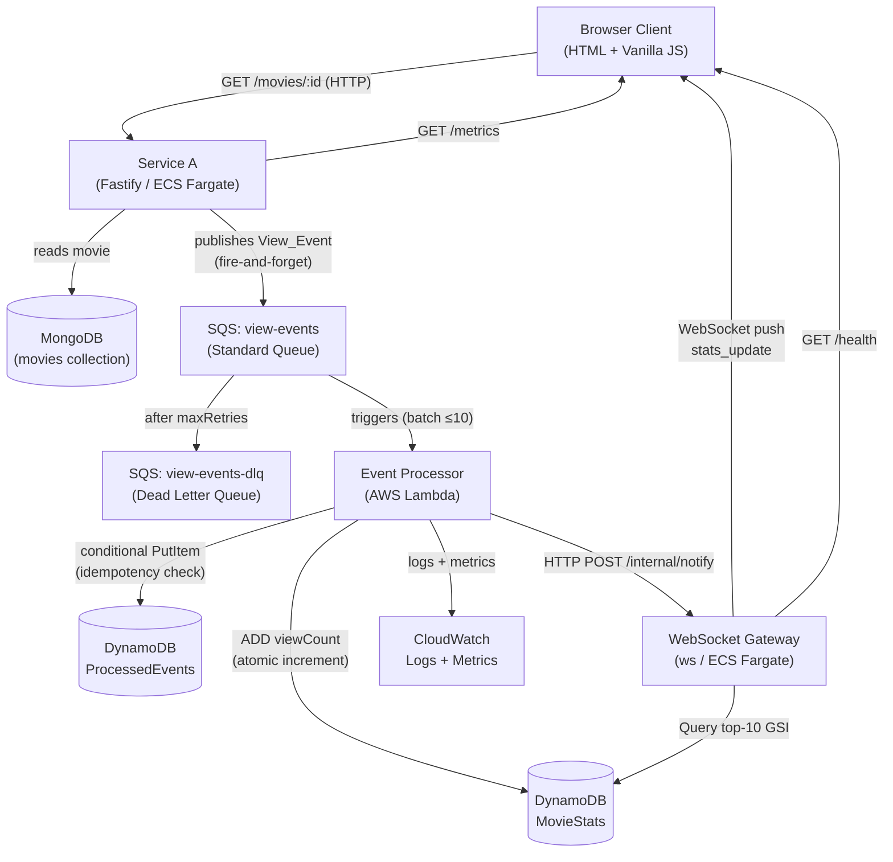

# Realtime Analytics Dashboard

A cloud-native distributed system that captures movie-view events from a REST API, processes them asynchronously via AWS Lambda, persists aggregated statistics in DynamoDB, and delivers live updates to browser clients over WebSocket.

Built for the PCD (Distributed Cloud Applications) university course, demonstrating independently deployed components, native AWS services, asynchronous communication, and real-time delivery.

---

## Architecture



**Main data flow:**
`GET /movies/:id` → Service A publishes View_Event to SQS → Lambda processes event and updates DynamoDB → WebSocket Gateway pushes update to all connected clients → Frontend displays updated statistics.

---

## Services

### Service A — Fast Lazy Bee (Node.js / Fastify)

Hosted on **AWS ECS Fargate** (always-running task).

Serves the movie REST API backed by MongoDB. On every `GET /movies/:id` request it publishes a `View_Event` to SQS asynchronously (fire-and-forget) — SQS publishing never delays the HTTP response. Exposes a `/metrics` endpoint for observability.

| Endpoint | Description |
|---|---|
| `GET /movies/:id` | Returns movie JSON; publishes View_Event to SQS |
| `GET /metrics` | Returns `{ totalPublished, publishErrors, avgPublishLatencyMs }` |

### Event Processor (Node.js — AWS Lambda)

Hosted on **AWS Lambda** (30-second timeout, ≥ 256 MB memory).

Triggered by the SQS event source mapping in batches of up to 10 messages. For each event it performs an idempotency check (conditional `PutItem` on `ProcessedEvents`), atomically increments the `viewCount` in `MovieStats` (`ADD` expression), notifies the WebSocket Gateway via HTTP POST, and publishes CloudWatch Metrics. Failed items are returned via `ReportBatchItemFailures` so only failed messages are retried.

### WebSocket Gateway (Node.js / ws)

Hosted on **AWS ECS Fargate** (always-running task).

Maintains WebSocket connections with browser clients. Receives notifications from Lambda on `POST /internal/notify`, queries the DynamoDB `MovieStats` GSI for the current top-10, stamps `deliveredAt`, and broadcasts a `stats_update` message to all connected clients. Applies backpressure when the incoming event rate exceeds 100/s (coalesces to at most 1 push/s per client).

| Endpoint | Description |
|---|---|
| `WS /ws` | WebSocket connection endpoint for browser clients |
| `GET /health` | Returns `{ status, connectedClients, backpressureActive }` |
| `POST /internal/notify` | Internal endpoint called by Lambda (not public) |

### Frontend (HTML + Vanilla JS)

**Static SPA** served by the WebSocket Gateway's HTTP server (or from S3 + CloudFront).

Connects to the Gateway over WebSocket, renders the live top-10 movies table, connected-user counter, recent activity feed, and a p50/p95/p99 latency chart. Implements exponential backoff reconnection (initial 1 s, multiplier 2, cap 30 s, max 10 attempts).

---

## Environment Variables

No hardcoded values exist in source code. All external dependencies are configured via environment variables.

### Service A

| Variable | Required | Description |
|---|---|---|
| `SQS_QUEUE_URL` | Yes | Full URL of the `view-events` SQS queue |
| `MONGODB_URI` | Yes | MongoDB connection string (e.g. `mongodb://host:27017/movies`) |
| `AWS_REGION` | Yes | AWS region where SQS is deployed (e.g. `eu-west-1`) |

See `service-a/.env.example` for a template.

### Event Processor (Lambda)

| Variable | Required | Description |
|---|---|---|
| `DYNAMODB_TABLE_STATS` | Yes | Name of the `MovieStats` DynamoDB table |
| `DYNAMODB_TABLE_EVENTS` | Yes | Name of the `ProcessedEvents` DynamoDB table |
| `GATEWAY_INTERNAL_URL` | Yes | Internal HTTP base URL of the WebSocket Gateway (e.g. `http://gateway:8081`) |
| `AWS_REGION` | Yes | AWS region where DynamoDB tables are deployed |

See `event-processor/.env.example` for a template.

### WebSocket Gateway

| Variable | Required | Default | Description |
|---|---|---|---|
| `DYNAMODB_TABLE_STATS` | Yes | — | Name of the `MovieStats` DynamoDB table |
| `AWS_REGION` | Yes | — | AWS region where DynamoDB is deployed |
| `PORT` | No | `8080` | Public WebSocket + HTTP port |
| `INTERNAL_PORT` | No | `8081` | Internal HTTP port for Lambda notifications |

See `websocket-gateway/.env.example` for a template.

---

## Build Instructions

### Prerequisites

- Node.js ≥ 18
- npm ≥ 9
- Docker (for container builds)
- AWS CLI v2 configured with appropriate credentials

### Install dependencies

From the repo root (if using npm workspaces):

```bash
npm install
```

Or install per service individually:

```bash
cd service-a && npm install
cd ../event-processor && npm install
cd ../websocket-gateway && npm install
```

### Build Docker images

```bash
# Service A
docker build -t service-a:latest ./service-a

# WebSocket Gateway
docker build -t websocket-gateway:latest ./websocket-gateway
```

### Package Lambda function

```bash
cd event-processor
npm install --omit=dev
zip -r function.zip src/ node_modules/ package.json
```

Or use the provided deploy script:

```bash
bash event-processor/deploy.sh
```

### Usage Instructions
Using the service-a (Fast Lazy Bee API):

##### How to build and run server

```bash
npm install
```

```bash
npm run dev
```

##### Testing example: 
# 1. Hit real movie → 200 + movie data
Invoke-RestMethod http://localhost:3000/api/v1/movies/573a1390f29313caabcd42e8

# 2. Check metrics → publishErrors: 1, totalPublished: 0
Invoke-RestMethod http://localhost:3000/api/v1/metrics

# 3. Hit fake ID → 404
Invoke-RestMethod http://localhost:3000/api/v1/movies/000000000000000000000000

# 4. Check metrics again → publishErrors still 1 (404 didn't trigger publish)
Invoke-RestMethod http://localhost:3000/api/v1/metrics


---

## Deploy Instructions

### 1. AWS Infrastructure

Provision the required AWS resources before deploying services:

- SQS queue `view-events` (`VisibilityTimeout=60s`, `maxReceiveCount=3`) and DLQ `view-events-dlq`
- DynamoDB table `MovieStats` (PK: `movieId`, billing: `PAY_PER_REQUEST`, GSI `viewCount-index` on `pk`/`viewCount`)
- DynamoDB table `ProcessedEvents` (PK: `requestId`, billing: `PAY_PER_REQUEST`, TTL on `ttl`)
- IAM role for Lambda with SQS, DynamoDB, CloudWatch permissions
- IAM role for ECS tasks with SQS send and DynamoDB query permissions

See `infrastructure/resources.md` for ARNs and names after provisioning.

### 2. Service A — ECS Fargate

```bash
# Push image to ECR
aws ecr get-login-password --region $AWS_REGION | docker login --username AWS --password-stdin $ECR_REGISTRY
docker tag service-a:latest $ECR_REGISTRY/service-a:latest
docker push $ECR_REGISTRY/service-a:latest

# Create/update ECS task definition and service via AWS Console or CLI
# Inject environment variables: SQS_QUEUE_URL, MONGODB_URI, AWS_REGION
```

The ECS service should run at least one always-on task in a public subnet with the security group allowing inbound traffic on port 3000.

### 3. WebSocket Gateway — ECS Fargate

```bash
# Push image to ECR
docker tag websocket-gateway:latest $ECR_REGISTRY/websocket-gateway:latest
docker push $ECR_REGISTRY/websocket-gateway:latest

# Create/update ECS task definition and service via AWS Console or CLI
# Inject environment variables: DYNAMODB_TABLE_STATS, AWS_REGION, PORT, INTERNAL_PORT
```

The ECS service should run at least one always-on task with the security group allowing inbound traffic on ports 8080 (public) and 8081 (internal).

### 4. Event Processor — Lambda

```bash
# Deploy using the provided script
bash event-processor/deploy.sh

# Or manually
aws lambda update-function-code \
  --function-name event-processor \
  --zip-file fileb://event-processor/function.zip

# Configure SQS event source mapping (batch size 10, ReportBatchItemFailures)
aws lambda create-event-source-mapping \
  --function-name event-processor \
  --event-source-arn $SQS_QUEUE_ARN \
  --batch-size 10 \
  --function-response-types ReportBatchItemFailures

# Set environment variables
aws lambda update-function-configuration \
  --function-name event-processor \
  --environment "Variables={DYNAMODB_TABLE_STATS=MovieStats,DYNAMODB_TABLE_EVENTS=ProcessedEvents,GATEWAY_INTERNAL_URL=http://<gateway-internal-host>:8081,AWS_REGION=$AWS_REGION}"
```

Lambda should be configured with a 30-second timeout and at least 256 MB of memory.

### 5. Frontend — Static Files

The frontend is served as static files by the WebSocket Gateway's HTTP server. Alternatively, upload to S3 and serve via CloudFront:

```bash
aws s3 sync ./frontend s3://$FRONTEND_BUCKET/ --delete
```

---

## Test Instructions

### Unit Tests

Run unit tests for each service:

```bash
# Service A
cd service-a && npm test

# Event Processor
cd event-processor && npm test

# WebSocket Gateway
cd websocket-gateway && npm test

# Frontend
cd frontend && npm test
```

Or run all tests from the root (if workspaces are configured):

```bash
npm test
```

### Property-Based Tests

Property-based tests use [fast-check](https://github.com/dubzzz/fast-check) and are co-located with unit tests. They run as part of the standard `npm test` command. Each property runs a minimum of 100 iterations.

| Property | Component | What it verifies |
|---|---|---|
| P1: Counter Invariant | Event Processor | N distinct events for same `movieId` → `viewCount` = N |
| P2: Idempotency | Event Processor | Event duplicated K times → `viewCount` = 1 |
| P3: Movie Isolation | Event Processor | Events for two `movieId`s don't affect each other's counts |
| P4: Serialization Round-Trip | Service A + Event Processor | `serialize(event)` → SQS → `deserialize(message)` yields identical fields |
| P5: Monotonically Non-Decreasing | WebSocket Gateway | `viewCount` values pushed to clients never go backwards |
| P6: Invalid Input Rejection | Event Processor | Malformed/missing-field messages never write to DynamoDB |
| P7: Backpressure Coalescing | WebSocket Gateway | N > 100 notifications in 1 s → each client receives exactly 1 push |

### Integration Tests

Integration tests require a running AWS environment (or LocalStack). Set the required environment variables before running:

```bash
# End-to-end smoke test
node tests/integration/e2e.js

# DLQ routing test (publishes a malformed message and waits for DLQ delivery)
node tests/integration/dlq-test.js
```

The e2e test connects a WebSocket client to the Gateway, calls `GET /movies/:id` on Service A, and asserts a `stats_update` message is received within 500 ms with `viewCount` ≥ 1.

### Load Tests

Load tests use [Artillery](https://www.artillery.io/). Install it globally first:

```bash
npm install -g artillery
```

Run the load test against the deployed environment:

```bash
artillery run tests/load/load-test.yml --output tests/load/report.json
artillery report tests/load/report.json
```

The load test simulates 200 virtual users for 60 seconds hitting `GET /movies/:id`. Assertions:
- p99 HTTP response latency < 200 ms
- Error rate < 0.1%
- WebSocket push latency p95 < 500 ms

To verify backpressure, run the load test at > 100 req/s and check:

```bash
curl http://<gateway-host>:8080/health
# Expected: { "status": "ok", "connectedClients": N, "backpressureActive": true }
```

### Local Testing (Without AWS Deployment)

For development and testing without deploying to AWS, run the services locally:

**Terminal 1 - Service A:**
```bash
cd service-a
npm run dev
```

**Terminal 2 - WebSocket Gateway:**
```bash
cd websocket-gateway
npm run dev
```

**Terminal 3 - Run Integration Tests:**
```bash
node tests/integration/e2e-local.js
```

This tests the full flow locally:
- WebSocket client connects to Gateway
- HTTP client calls Service A `GET /movies/:id`
- Service A publishes View_Event to SQS (mock)
- Gateway receives notification and broadcasts `stats_update`
- WebSocket client receives `stats_update` with updated view count

**Expected output:**
```
============================================================
End-to-End Integration Tests (Local)
============================================================

[TEST 1] Health Check
✓ Health check passed

[TEST 2] Service A Metrics
✓ Service A metrics passed

[TEST 3] WebSocket Connection and Stats Update
✓ WebSocket stats_update test passed

[TEST 4] Multiple Concurrent Connections
✓ Multiple connections test passed

============================================================
Test Summary
============================================================
✓ Passed: 4
✗ Failed: 0
Total: 4

✓ All tests passed!
```

For detailed testing instructions, see `TESTING_GUIDE.md` and `tests/README.md`.

---

## Accessing the Dashboard

1. Open a browser and navigate to `http://<gateway-host>:8080` (or the CloudFront/S3 URL if using static hosting).
2. The dashboard connects automatically to the WebSocket Gateway at `ws://<gateway-host>:8080/ws`.
3. On connection, the dashboard displays the current top-10 movies by view count, the connected-user count, and the recent activity feed.
4. Trigger view events by calling `GET /movies/:id` on Service A — the dashboard updates in real time.
5. The latency chart (bottom of the page) shows p50/p95/p99 end-to-end latency over a 60-second sliding window.

If the WebSocket connection drops, the dashboard automatically reconnects with exponential backoff and displays a "Reconnecting..." indicator. After 10 failed attempts it displays "Connection lost. Please refresh the page."

---

## Project Structure

```
.
├── service-a/              # Fast Lazy Bee — Fastify REST API + SQS publisher
│   ├── src/
│   ├── Dockerfile
│   ├── package.json
│   └── .env.example
├── event-processor/        # AWS Lambda — SQS consumer, DynamoDB writer
│   ├── src/
│   ├── deploy.sh
│   ├── package.json
│   └── .env.example
├── websocket-gateway/      # WebSocket server — real-time push to clients
│   ├── src/
│   ├── Dockerfile
│   ├── package.json
│   └── .env.example
├── frontend/               # Static SPA — HTML + Vanilla JS dashboard
│   ├── index.html
│   ├── app.js
│   ├── dashboard.js
│   ├── latencyChart.js
│   └── style.css
├── tests/
│   ├── integration/        # End-to-end and DLQ routing tests
│   └── load/               # Artillery load test configuration
├── infrastructure/
│   └── resources.md        # Provisioned AWS resource ARNs and names
├── package.json            # Root package (workspaces)
└── README.md
```
