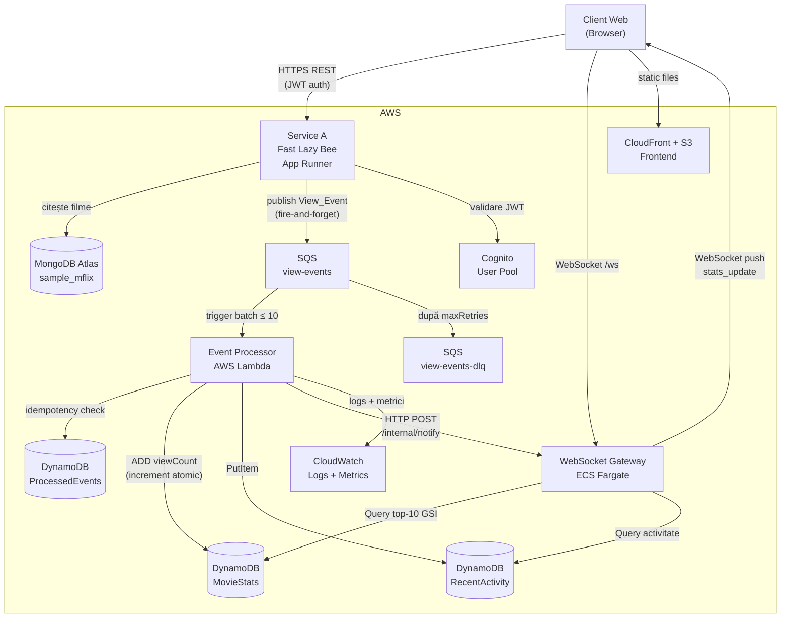

# Dashboard de Analytics în Timp Real

**Proiect 1 — PCD Aplicații Distribuite în Cloud**

Un sistem distribuit de analytics în timp real construit pe baza API-ului REST Fast Lazy Bee (filme). Sistemul captează evenimente de vizualizare a filmelor, le procesează asincron printr-un pipeline cloud-native și afișează statistici live pe un dashboard în browser.

**Echipă:**
- Chiriac Laura-Florina - MISS2
- Bejan Paul-Eusebiu - MISS2
- Bindiu Ana-Maria - MISS2

---

## Arhitectură



### Componente

| Componentă | Runtime | Hosting |
|---|---|---|
| Service A (Fast Lazy Bee) | TypeScript / Fastify v5 | AWS App Runner |
| Event Processor | Node.js | AWS Lambda |
| WebSocket Gateway | Node.js / ws | AWS ECS Fargate |
| Dashboard Frontend | HTML + Vanilla JS | S3 + CloudFront |

**Fluxul principal de date:**
`GET /movies/:id` → Service A publică View_Event în SQS → Lambda procesează evenimentul și actualizează DynamoDB → WebSocket Gateway trimite update-ul către toți clienții conectați → Frontend-ul afișează statisticile actualizate.

### Servicii

#### Service A — Fast Lazy Bee (TypeScript / Fastify)

Servește API-ul REST de filme, backed de MongoDB. La fiecare `GET /movies/:id` publică un `View_Event` în SQS asincron (fire-and-forget) — publicarea în SQS nu întârzie niciodată răspunsul HTTP.

| Endpoint | Descriere |
|---|---|
| `GET /movies/:id` | Returnează filmul JSON; publică View_Event în SQS |
| `GET /metrics` | Returnează `{ totalPublished, publishErrors, avgPublishLatencyMs }` |
| `GET /health` | Health check |

#### Event Processor (Node.js — AWS Lambda)

Triggerat de SQS în batch-uri de până la 10 mesaje. Pentru fiecare eveniment: verificare de idempotență (`PutItem` condiționat pe `ProcessedEvents`), increment atomic al `viewCount` în `MovieStats` (expresie `ADD`), notificare WebSocket Gateway via HTTP POST, publicare metrici CloudWatch. Mesajele eșuate sunt returnate via `ReportBatchItemFailures`.

#### WebSocket Gateway (Node.js / ws)

Menține conexiuni WebSocket cu clienții browser. Primește notificări de la Lambda pe `POST /internal/notify`, interoghează DynamoDB GSI pentru top-10, și broadcast-ează `stats_update` către toți clienții. Aplică backpressure când rata depășește 100 events/s.

| Endpoint | Descriere |
|---|---|
| `WS /ws` | Conexiune WebSocket pentru clienți browser |
| `GET /health` | Returnează `{ status, connectedClients, backpressureActive }` |
| `POST /internal/notify` | Endpoint intern apelat de Lambda |

#### Frontend (HTML + Vanilla JS)

SPA static servit din S3 + CloudFront. Se conectează la Gateway prin WebSocket, afișează: tabelul top-10 filme, contor utilizatori conectați, flux de activitate recentă, grafic de latență p50/p95/p99. Implementează reconectare cu exponential backoff (1s × 2, cap 30s, max 10 încercări).

---

## Cerințe preliminare

- AWS CLI v2 instalat ([instrucțiuni](https://docs.aws.amazon.com/cli/latest/userguide/getting-started-install.html))
- Node.js ≥ 18
- Docker (cu Colima sau Docker Desktop) — pentru construirea imaginilor de container
- AWS CDK v2 (`npm install -g aws-cdk`)

---

## Configurare AWS CLI

### 1. Crearea unui utilizator IAM

În AWS Console → IAM → Users:

1. Click **Create user**
2. Nume: `pcd-dev` (sau orice alt nume)
3. Atașați politica **AdministratorAccess** (pentru simplitate în cadrul proiectului)
4. La pasul final, selectați **Create access key** → **Command Line Interface (CLI)**
5. Salvați **Access Key ID** și **Secret Access Key**

### 2. Configurarea profilului AWS CLI

```bash
aws configure --profile <AWS_PROFILE>
```

Vi se vor cere:
```
AWS Access Key ID:     <ACCESS_KEY_ID>
AWS Secret Access Key: <SECRET_ACCESS_KEY>
Default region name:   us-east-1
Default output format: json
```

Aceasta creează/actualizează două fișiere:

- `~/.aws/credentials` — stochează cheile de acces
- `~/.aws/config` — stochează regiunea și formatul de output

### 3. Verificarea configurării

```bash
aws sts get-caller-identity --profile <AWS_PROFILE>
```

Ar trebui să returneze:
```json
{
    "UserId": "<USER_ID>",
    "Account": "<ACCOUNT_ID>",
    "Arn": "arn:aws:iam::<ACCOUNT_ID>:user/pcd-dev"
}
```

### 4. Reîmprospătarea credențialelor

**Chei de acces IAM (access keys):** Nu expiră automat. Dacă le rotați sau le dezactivați din consolă, trebuie să rulați din nou `aws configure --profile <AWS_PROFILE>` cu noile chei.

**Dacă folosiți AWS SSO / Identity Center** (în loc de access keys):

```bash
# Configurare inițială (o singură dată)
aws configure sso --profile <AWS_PROFILE>

# Login — trebuie rulat periodic când sesiunea expiră (de obicei la 8-12 ore)
aws sso login --profile <AWS_PROFILE>
```

Veți ști că sesiunea a expirat când comenzile AWS returnează:
```
Error: The SSO session associated with this profile has expired or is otherwise invalid.
```

Soluția: `aws sso login --profile <AWS_PROFILE>`

**Dacă folosiți token-uri temporare (STS):** Acestea expiră după 1-12 ore. Trebuie regenerate manual sau prin scriptul organizației voastre.

### 5. Utilizarea profilului

Toate comenzile AWS din acest proiect folosesc flag-ul `--profile <AWS_PROFILE>`. Alternativ, puteți seta variabila de mediu:

```bash
export AWS_PROFILE=<AWS_PROFILE>
# acum nu mai trebuie --profile la fiecare comandă
```

---

## Configurare inițială

### 1. MongoDB Atlas

1. Creați un cluster gratuit M0 pe [cloud.mongodb.com](https://cloud.mongodb.com)
2. Creați un utilizator de bază de date cu acces read/write
3. Setați IP allowlist la `0.0.0.0/0` (necesar — App Runner are IP-uri de ieșire dinamice)
4. Încărcați **Sample Dataset** (include `sample_mflix` cu colecția de filme)
5. Copiați connection string-ul: `mongodb+srv://<user>:<password>@<cluster>.mongodb.net/sample_mflix`
6. Stocați în SSM:
   ```bash
   bash infrastructure/ssm/create-ssm-params.sh --mongo
   # introduceți connection string-ul când vi se cere
   ```

### 2. Secret intern (pentru autentificarea Lambda → Gateway)

```bash
bash infrastructure/ssm/create-ssm-params.sh
# generează un secret aleatoriu de 32 caractere și îl stochează la /analytics/INTERNAL_SECRET
```

### 3. CDK Bootstrap (o singură dată per cont/regiune)

```bash
cd infra
./node_modules/.bin/cdk bootstrap --profile <AWS_PROFILE>
```

---

## Dezvoltare locală

### Service A

```bash
cd service-a
npm install
cp .env.example .env          # editați cu valorile voastre
npm run dev                   # pornește pe http://localhost:3000
```

### WebSocket Gateway

```bash
cd websocket-gateway
cp .env.example .env
node src/index.js             # WS pe :8080, HTTP intern pe :8081
```

### Event Processor (testare locală)

```bash
cd event-processor
npm install
npm test                      # rulează testele unitare
```

Lambda-ul nu se rulează local ca server — se testează prin teste unitare sau prin deploy pe AWS.

### Variabile de mediu

Nicio valoare nu este hardcodată în cod. Toate dependențele externe sunt configurate prin variabile de mediu.

**Service A:**

| Variabilă | Obligatorie | Descriere |
|---|---|---|
| `MONGO_URL` | Da | Connection string MongoDB |
| `MONGO_DB_NAME` | Da | Numele bazei de date (ex: `sample_mflix`) |
| `SQS_QUEUE_URL` | Da | URL-ul complet al cozii SQS `view-events` |
| `AWS_REGION` | Da | Regiunea AWS (ex: `us-east-1`) |
| `COGNITO_JWKS_URL` | Da | Endpoint JWKS pentru validarea JWT |
| `APP_PORT` | Nu | Port server (default: `3000`) |

**Event Processor (Lambda):**

| Variabilă | Obligatorie | Descriere |
|---|---|---|
| `DYNAMODB_TABLE_STATS` | Da | Numele tabelei `MovieStats` |
| `DYNAMODB_TABLE_EVENTS` | Da | Numele tabelei `ProcessedEvents` |
| `DYNAMODB_TABLE_RECENT_ACTIVITY` | Da | Numele tabelei `RecentActivity` |
| `GATEWAY_INTERNAL_URL` | Da | URL-ul HTTP intern al WebSocket Gateway |
| `AWS_REGION` | Da | Regiunea AWS |

**WebSocket Gateway:**

| Variabilă | Obligatorie | Descriere |
|---|---|---|
| `DYNAMODB_TABLE_STATS` | Da | Numele tabelei `MovieStats` |
| `AWS_REGION` | Da | Regiunea AWS |
| `PORT` | Nu | Port WebSocket public (default: `8080`) |
| `INTERNAL_PORT` | Nu | Port HTTP intern pentru notificări Lambda (default: `8081`) |

Fiecare serviciu are un fișier `.env.example` cu toate variabilele. Copiați-l ca `.env` și completați valorile.

> **Notă:** În producție, variabilele sunt injectate automat prin CDK (App Runner env vars, Lambda env vars, ECS task definition). Nu se hardcodează niciodată secrete în cod.

---

## Deploy

### Pasul 1: Construiți și publicați imaginile Docker

```bash
# Autentificare la ECR
aws ecr get-login-password --profile <AWS_PROFILE> --region us-east-1 \
  | docker login --username AWS --password-stdin \
    <ACCOUNT_ID>.dkr.ecr.us-east-1.amazonaws.com

# Service A
cd service-a
docker build --platform linux/amd64 -t service-a:latest .
docker tag service-a:latest <ACCOUNT_ID>.dkr.ecr.us-east-1.amazonaws.com/service-a:latest
docker push <ACCOUNT_ID>.dkr.ecr.us-east-1.amazonaws.com/service-a:latest

# WebSocket Gateway
cd ../websocket-gateway
docker build --platform linux/amd64 -t websocket-gateway:latest .
docker tag websocket-gateway:latest <ACCOUNT_ID>.dkr.ecr.us-east-1.amazonaws.com/websocket-gateway:latest
docker push <ACCOUNT_ID>.dkr.ecr.us-east-1.amazonaws.com/websocket-gateway:latest
```

> **Important:** Construiți întotdeauna cu `--platform linux/amd64`. Atât App Runner cât și ECS Fargate rulează pe amd64. Construirea pe un Mac cu procesor M fără acest flag produce imagini arm64 care nu vor porni.

### Pasul 2: Deploy-ul stack-ului CDK

```bash
cd infra
./node_modules/.bin/cdk deploy --profile <AWS_PROFILE> --no-rollback
```

Aceasta provizionează: VPC, cozi SQS, tabele DynamoDB, Lambda, ECS Fargate + ALB + CloudFront (WSG), App Runner (Service A), S3 + CloudFront (frontend), Cognito User Pool, alertă de buget, VPC endpoints pentru DynamoDB/SSM/CloudWatch.

### Pasul 3: Forțați actualizarea serviciilor (după push-ul imaginilor)

```bash
# App Runner — declanșați redeploy
aws apprunner start-deployment \
  --service-arn <APP_RUNNER_SERVICE_ARN> \
  --profile <AWS_PROFILE> --region us-east-1

# ECS — forțați un task nou
aws ecs update-service \
  --cluster analytics-cluster \
  --service <ECS_SERVICE_NAME> \
  --force-new-deployment \
  --profile <AWS_PROFILE> --region us-east-1
```

### Pasul 4: Deploy-ul frontend-ului

```bash
aws s3 sync ./frontend s3://<FRONTEND_S3_BUCKET>/ \
  --delete --profile <AWS_PROFILE> --region us-east-1

aws cloudfront create-invalidation \
  --distribution-id <FRONTEND_CF_DISTRIBUTION_ID> \
  --paths "/*" --profile <AWS_PROFILE>
```

---

## Autentificare (Cognito)

Sistemul folosește **AWS Cognito User Pool** pentru autentificare.

### Crearea unui utilizator

```bash
aws cognito-idp admin-create-user \
  --user-pool-id <COGNITO_USER_POOL_ID> \
  --username user@example.com \
  --message-action SUPPRESS \
  --profile <AWS_PROFILE> --region us-east-1

aws cognito-idp admin-set-user-password \
  --user-pool-id <COGNITO_USER_POOL_ID> \
  --username user@example.com \
  --password 'ParolaVoastra123' \
  --permanent \
  --profile <AWS_PROFILE> --region us-east-1
```

### Obținerea unui token JWT

```bash
aws cognito-idp initiate-auth \
  --auth-flow USER_PASSWORD_AUTH \
  --auth-parameters USERNAME=user@example.com,PASSWORD='ParolaVoastra123' \
  --client-id <COGNITO_APP_CLIENT_ID> \
  --profile <AWS_PROFILE> --region us-east-1 \
  --query "AuthenticationResult.IdToken" \
  --output text
```

### Utilizarea token-ului JWT

```bash
curl -H "Authorization: Bearer <IdToken>" \
  https://<SERVICE_A_URL>/api/v1/movies?page=1&pageSize=5
```

---

## Accesarea Dashboard-ului

1. Deschideți un browser și navigați la `<FRONTEND_CLOUDFRONT_URL>`
2. Dashboard-ul se conectează automat la WebSocket Gateway la `wss://<WSG_CLOUDFRONT_URL>/ws`
3. La conectare, dashboard-ul afișează: top-10 filme după vizualizări, contorul de utilizatori conectați, fluxul de activitate recentă
4. Declanșați evenimente de vizualizare apelând `GET /movies/:id` pe Service A — dashboard-ul se actualizează în timp real
5. Graficul de latență (partea de jos) arată p50/p95/p99 end-to-end pe o fereastră glisantă de 60 secunde

Dacă conexiunea WebSocket cade, dashboard-ul se reconectează automat cu exponential backoff și afișează un indicator „Reconnecting...". După 10 încercări eșuate afișează „Connection lost. Please refresh the page."

---

## Teste

### Teste unitare

```bash
cd service-a && npm test        # Service A
cd event-processor && npm test  # Event Processor
```

### Teste property-based

Testele property-based folosesc [fast-check](https://github.com/dubzzz/fast-check) și rulează ca parte din `npm test`. Fiecare proprietate rulează minim 100 de iterații.

| Proprietate | Componentă | Ce verifică |
|---|---|---|
| P1: Counter Invariant | Event Processor | N evenimente distincte pentru același `movieId` → `viewCount` = N |
| P2: Idempotency | Event Processor | Eveniment duplicat de K ori → `viewCount` = 1 |
| P3: Movie Isolation | Event Processor | Evenimentele pentru două `movieId`-uri nu se afectează reciproc |
| P4: Serialization Round-Trip | Service A | `serialize(event)` → SQS → `deserialize(message)` produce câmpuri identice |

### Teste de încărcare (load tests)

```bash
cd load-tests
npm install
npm run all        # rulează toate cele 6 teste + generează RESULTS.md
```

Consultați `load-tests/README.md` pentru comenzi individuale per test.

---

## Resurse AWS principale

| Resursă | Placeholder |
|---|---|
| App Runner URL | `<SERVICE_A_URL>` |
| WSG CloudFront | `<WSG_CLOUDFRONT_URL>` |
| WSG ALB | `<WSG_ALB_URL>` |
| Frontend CloudFront | `<FRONTEND_CLOUDFRONT_URL>` |
| Frontend S3 Bucket | `<FRONTEND_S3_BUCKET>` |
| CloudFront Distribution ID | `<FRONTEND_CF_DISTRIBUTION_ID>` |
| Cognito User Pool | `<COGNITO_USER_POOL_ID>` |
| Cognito App Client | `<COGNITO_APP_CLIENT_ID>` |
| ECR: service-a | `<ACCOUNT_ID>.dkr.ecr.us-east-1.amazonaws.com/service-a` |
| ECR: websocket-gateway | `<ACCOUNT_ID>.dkr.ecr.us-east-1.amazonaws.com/websocket-gateway` |
| DynamoDB: MovieStats | `MovieStats` |
| DynamoDB: RecentActivity | `RecentActivity` |
| DynamoDB: ProcessedEvents | `ProcessedEvents` |
| SQS: view-events | `https://sqs.us-east-1.amazonaws.com/<ACCOUNT_ID>/view-events` |
| SQS: view-events-dlq | `https://sqs.us-east-1.amazonaws.com/<ACCOUNT_ID>/view-events-dlq` |
| Lambda | `event-processor` |
| ECS Cluster | `analytics-cluster` |

---

## Ștergerea resurselor (teardown)

```bash
cd infra
./node_modules/.bin/cdk destroy --profile <AWS_PROFILE>
```

Aceasta șterge toate resursele provizionate. Tabelele DynamoDB și bucket-ul S3 au `removalPolicy: DESTROY`, deci sunt complet curățate.

---

## Structura repository-ului

```
service-a/          ← API REST Fast Lazy Bee (TypeScript / Fastify / MongoDB)
event-processor/    ← Funcție Lambda (Node.js)
websocket-gateway/  ← WebSocket Gateway (Node.js / ws / ECS Fargate)
frontend/           ← Dashboard (HTML vanilla + JS + Tailwind + Chart.js)
infra/              ← Stack AWS CDK (TypeScript)
load-tests/         ← Teste de performanță (Node.js)
infrastructure/     ← Scripturi de configurare manuală (SQS, SSM)
given_assignment/   ← Specificația temei
README.md           ← Acest fișier
```
