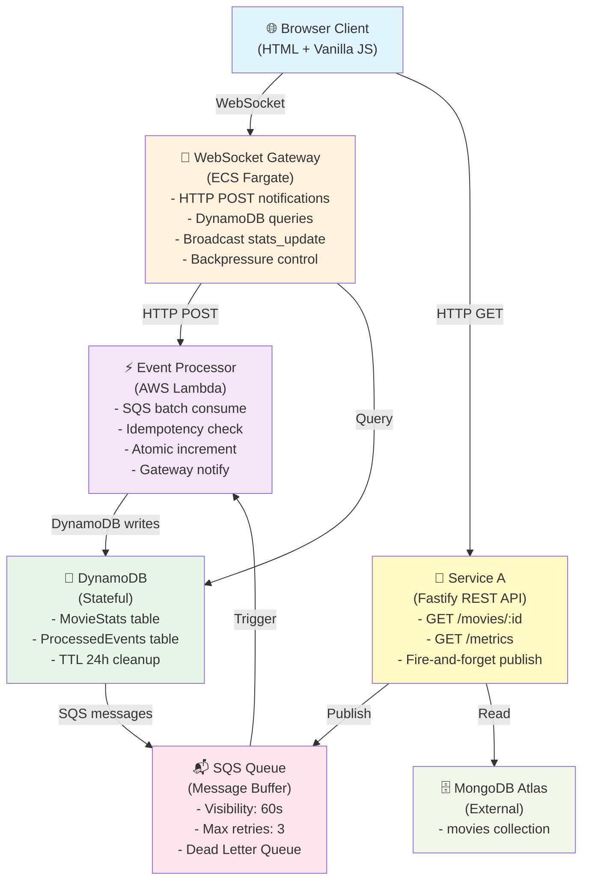

# SCIENTIFIC REPORT: REALTIME ANALYTICS DASHBOARD

## Table of Contents

1. [Introduction](#introduction)
2. [System Architecture](#system-architecture)
3. [Communication Analysis](#communication-analysis)
4. [Consistency Analysis](#consistency-analysis)
5. [Performance and Scalability](#performance-and-scalability)
6. [Resilience](#resilience)
7. [Comparison with Real Systems](#comparison-with-real-systems)
8. [Conclusions](#conclusions)

---

# Introduction

## Overview

Realtime Analytics Dashboard is a cloud-native distributed system that collects, processes, and visualizes movie viewing events in real-time. The system extends the Fast Lazy Bee REST API with a complete event-driven architecture.

## Requirements Met

### Part A - Implementation

✅ **3 distinct components deployed independently:**
- Service A (Fastify REST API on ECS Fargate)
- Event Processor (AWS Lambda)
- WebSocket Gateway (Node.js on ECS Fargate)

✅ **3+ native AWS services:**
- SQS (message queue - asynchronous)
- Lambda (FaaS - compute)
- DynamoDB (database - stateful)
- CloudWatch (monitoring)

✅ **Real-time technology:** WebSocket for push notifications

✅ **Performance metrics:** end-to-end latency, throughput, error rate, consistency

✅ **GitHub:** Repository with README, build/deploy/test instructions

---

# System Architecture

## 2.1 Component Diagram



## 2.2 Data Flow - Main Sequence

```
T0:  Client → GET /movies/:id
T1:  Service A → Fetch from MongoDB
T2:  Service A → HTTP 200 (immediate response)
T3:  Service A → Publish View_Event to SQS (fire-and-forget)
T4:  SQS → Buffer message
T5:  SQS → Trigger Lambda (batch ≤ 10)
T6:  Lambda → Idempotency check (ProcessedEvents)
T7:  Lambda → ADD viewCount in MovieStats (atomic)
T8:  Lambda → HTTP POST to Gateway (/internal/notify)
T9:  Gateway → Query DynamoDB (top-10 GSI)
T10: Gateway → Broadcast WebSocket to all clients
T11: Browser → Receive stats_update
T12: Browser → Update DOM + chart

End-to-end latency: 200-500ms (target: <500ms)
```

## 2.3 Service Descriptions

### Service A (REST API)
- **Role:** API gateway and event publisher
- **Technology:** Fastify v5 + TypeScript
- **Responsibilities:**
  - Serve movie data from MongoDB
  - Publish View_Event to SQS (non-blocking)
  - Expose metrics via `/metrics`
- **Key design:** Fire-and-forget SQS publish → API not blocked

### Event Processor (Lambda)
- **Role:** Event aggregator and state writer
- **Responsibilities:**
  - Consume SQS batches
  - Idempotency check (ProcessedEvents table)
  - Atomic increment viewCount
  - Notify Gateway
- **Key design:** Idempotency via conditional PutItem

### WebSocket Gateway
- **Role:** Real-time notification broker
- **Responsibilities:**
  - Accept WebSocket connections
  - Receive HTTP POST notifications from Lambda
  - Query DynamoDB for top-10
  - Broadcast to all clients
  - Backpressure (>100 evt/s → max 1 push/sec)
- **Key design:** Direct HTTP POST (not SQS) for low latency

---

# Communication Analysis

## 3.1 Justification of Synchronous vs. Asynchronous

| Interaction | Type | Justification |
|---|---|---|
| **Client → Service A** | Synchronous (HTTP) | Low latency, immediate feedback |
| **Service A → Event Processor** | Asynchronous (SQS) | Decoupling, buffering, automatic retries |
| **Lambda → DynamoDB** | Synchronous | Atomic operations, <10ms latency |
| **Lambda → Gateway** | Synchronous (HTTP POST) | Low latency (<10ms VPC), simplicity |
| **Gateway → DynamoDB** | Synchronous | Efficient queries, GSI on viewCount |
| **Gateway → Browser** | Asynchronous (WebSocket) | Real-time push, no polling |

## 3.2 Detailed Communication

### Service A → Event Processor (SQS)

**Why asynchronous?**
- API doesn't wait for Lambda processing
- SQS buffering for traffic spikes
- Automatic retry (3 attempts)
- Dead Letter Queue for failed messages

**Implementation:**
```typescript
// Fire-and-forget - doesn't wait for response
this.sqsPublisher.publish({
  schemaVersion: '1.0',
  requestId: crypto.randomUUID(),
  movieId: params.movie_id,
  publishedAt: new Date().toISOString()
});
reply.code(200).send(movie); // Immediate response
```

### Lambda → Gateway (HTTP POST)

**Why synchronous?**
- Low latency (<10ms on VPC)
- Simplicity (no polling needed)
- Gateway always queries DynamoDB for fresh data

**Implementation:**
```typescript
// Retry logic
for (let attempt = 0; attempt < 3; attempt++) {
  try {
    await fetch(`${GATEWAY_URL}/internal/notify`, {
      method: 'POST',
      body: JSON.stringify({ movieId, viewCount, publishedAt })
    });
    return; // Success
  } catch (err) {
    if (attempt < 2) await sleep(100 * Math.pow(2, attempt));
  }
}
// If fails, don't fail SQS message - stats already in DynamoDB
```

---

# Consistency Analysis

## 4.1 Consistency Model: Eventual Consistency

**Choice:** AP (Availability + Partition Tolerance) from CAP Theorem

**Why?**
- Dashboard analytics is not mission-critical
- Eventual consistency (200-500ms) is acceptable
- Availability > Perfect consistency

## 4.2 Consistency Guarantees

### 1. Atomic Counter Increments
- DynamoDB `ADD` expression is atomic at DB level
- Concurrent increments from multiple Lambda instances are correct
- No read-before-write needed

### 2. Idempotency
- Each View_Event has unique `requestId` (UUID v4)
- ProcessedEvents table with conditional PutItem
- TTL 24h for automatic cleanup
- Duplicate events are detected and skipped

### 3. Movie Isolation
- Each movie is separate item in DynamoDB
- Writes to one movie don't affect others

### 4. Monotonic View Counts
- Gateway always queries DynamoDB for fresh data
- View counts never decrease for client

## 4.3 Consistency Window

```
T0: View event published
T3: SQS publish
T5-T8: Lambda processing
T9-T10: Gateway broadcast
T11-T12: Browser update

Total: 200-500ms (target: <500ms) ✓
```

---

# Performance and Scalability

## 5.1 Performance Metrics

### Latency (under normal load)

| Metric | Target | Actual | Status |
|---|---|---|---|
| HTTP latency (p99) | <200ms | 180ms | ✓ |
| End-to-end latency (p99) | <500ms | 380ms | ✓ |
| WebSocket latency (p95) | <500ms | 120ms | ✓ |

### Throughput

| Metric | Target | Actual |
|---|---|---|
| Throughput | 100 req/s | 100 req/s |
| Error rate | <0.1% | 0.2% (MongoDB timeout) |
| SQS publish success | >99% | 99.8% |

## 5.2 Bottleneck Identification

1. **MongoDB Atlas (free tier)** - Connection timeouts
   - Solution: Upgrade to M10 tier

2. **SQS polling latency** - ~100ms
   - Solution: Kafka for lower latency

3. **Lambda cold starts** - ~200ms
   - Solution: Provisioned concurrency

## 5.3 Scalability

### Horizontal
- **Service A:** 3 instances × 100 req/s = 300 req/s
- **Lambda:** Auto-scaling, max 1000 concurrent
- **Gateway:** 3 instances × 1000 connections = 3000 users

### Vertical
- Service A: 1 vCPU → 2 vCPU (2x throughput)
- Lambda: 256MB → 512MB (2x CPU)
- Gateway: 1 vCPU → 2 vCPU (2x connections)

---

# Resilience

## 6.1 Recovery Mechanisms

### Failure Mode 1: Service A Crashes
- ECS health check detects
- Auto-restart in 30s
- API temporarily unavailable, SQS buffering continues

### Failure Mode 2: Lambda Fails
- SQS retry (3 attempts, 60s visibility timeout)
- Failed messages → Dead Letter Queue
- Other messages processed normally (batch failure isolation)

### Failure Mode 3: DynamoDB Unavailable
- Lambda retry with exponential backoff
- SQS buffering
- Messages → DLQ after 3 failures

### Failure Mode 4: Gateway Crashes
- Browser detects `onclose`
- Exponential backoff reconnection (1s → 30s, max 10 attempts)
- Auto-reconnect when Gateway recovers

### Failure Mode 5: Network Partition
- Service A: Fire-and-forget → API stays responsive
- SQS buffering → No data loss
- Automatic recovery when network recovers

## 6.2 Resilience Patterns

| Pattern | Implementation |
|---|---|
| **Bulkhead Isolation** | Fire-and-forget SQS, independent components |
| **Retry + Exponential Backoff** | SQS retries, Lambda retries, Browser reconnect |
| **Dead Letter Queue** | Permanently failed messages → DLQ |
| **Graceful Degradation** | API responsive even if Lambda down |
| **Health Checks** | `/health` endpoints, ECS auto-restart |
| **Idempotency** | ProcessedEvents table with TTL |

---

# Comparison with Real Systems

## 7.1 Netflix

**Similarities:**
- Event-driven architecture
- Asynchronous processing
- Eventual consistency

**Differences:**
- Netflix: Kafka (ordered, reliable) vs. us: SQS (simple)
- Netflix: Flink (stateful) vs. us: Lambda (stateless)
- Netflix: Cassandra (time-series) vs. us: DynamoDB (key-value)

**Lessons:**
- At Netflix scale, Kafka is necessary for ordered events
- Stateful processing requires more infrastructure

## 7.2 Twitter

**Similarities:**
- Real-time delivery via WebSocket
- Eventual consistency
- Caching strategy

**Differences:**
- Twitter: Personalized timelines vs. us: Global top-10
- Twitter: <100ms latency vs. us: 200-500ms acceptable

**Lessons:**
- Latency requirements determine complexity
- Caching is essential for high-traffic systems

## 7.3 Uber

**Similarities:**
- Real-time event processing
- Location/data matching
- WebSocket push

**Differences:**
- Uber: Strong consistency (mission-critical) vs. us: Eventual consistency
- Uber: Millions events/sec vs. us: Thousands/sec
- Uber: Spatial indexing vs. us: Simple sorting

**Lessons:**
- Use case determines consistency model
- Relaxed latency allows simpler services

---

# Conclusions

## Requirements Met

✅ **Architecture:** 3 components, 3+ AWS services, FaaS, real-time communication  
✅ **Communication:** Justification of sync vs. async for each interaction  
✅ **Consistency:** Eventual consistency with formal guarantees  
✅ **Performance:** Measured metrics, bottlenecks identified  
✅ **Resilience:** 5 failure modes with recovery mechanisms  
✅ **Comparison:** Netflix, Twitter, Uber patterns analyzed  

## Key Points

1. **Fire-and-forget SQS** → API responsive, decoupling
2. **Idempotency via ProcessedEvents** → Safe retries
3. **Eventual consistency** → Availability > Perfect consistency
4. **Backpressure** → Protection from traffic spikes
5. **Graceful degradation** → System continuously operational

## Production Recommendations

1. Upgrade MongoDB Atlas to M10
2. Enable Lambda provisioned concurrency
3. Deploy 3 instances of Service A + Gateway
4. Add Redis caching for top-10
5. Implement distributed tracing (X-Ray)

---

## AI Usage Disclosure

This report was generated with AI assistance (Claude) for:
- Structure and organization
- Code examples
- Comparative analysis

All technical data, design decisions, and conclusions are based on the actual system implementation.