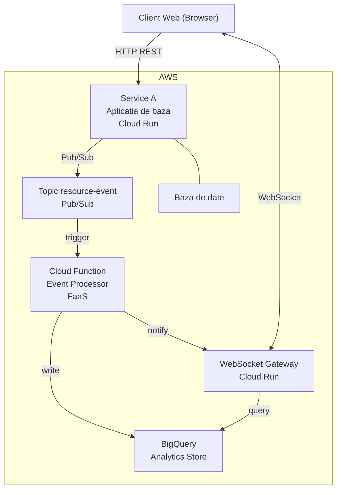

# Proiect PCD - Aplicatii Distribuite in Cloud

## Contents

- Informatii generale
- Cerinte comune (ambele proiecte)
- Aplicatia de baza
- Proiect 1 - Dashboard de Analytics in Timp Real
  - Context
  - Arhitectura propusa
  - Cerinte specifice
  - Metrici de evaluat
  - Puncte bonus
- Proiect 2 - Sistem Distribuit de Procesare si Clasificare a Recenziilor
  - Context
  - Arhitectura propusa
  - Cerinte specifice
  - Metrici de evaluat
  - Puncte bonus
- Utilizarea instrumentelor de inteligenta artificiala
- Criterii de evaluare
- Penalizari

---

## Informatii generale

- **Termen de predare:** 27-30 aprilie (Saptamana 10)
- **Mod de lucru:** echipe de 2-4 persoane
- **Livrabile:** cod sursa (repository GitHub) + raport stiintific (PDF, minim 2000 de cuvinte, aprox 4-5 pagini)
- **Prezentare:** demo live de ~10 minute in cadrul laboratorului
- **Inteligenta Artificiala:** permisa, vezi limitari

---

## Cerinte comune (ambele proiecte)

Fiecare proiect consta din doua parti:

### Partea A - Implementare

Aplicatia distribuita trebuie sa indeplineasca urmatoarele cerinte minime:

1. Minim 3 componente (servicii) distincte, deployate independent
2. Minim 3 servicii native cloud (Google Cloud, AWS, Azure), din care cel putin unul stateful (baza de date, storage)
3. Cel putin o componenta FaaS (Google Cloud Functions, AWS Lambda, Azure Functions)
4. Cel putin o tehnologie de comunicare in timp real (WebSocket, gRPC, Server-Sent Events)
5. Metrici de performanta relevante pentru sistemul distribuit (latenta, throughput, rata de erori, consistenta)
6. Cod sursa versionat pe GitHub cu README clar (instructiuni de build, deploy si testare)

### Partea B - Raport stiintific

Raportul analizeaza sistemul construit din perspectiva principiilor studiate in curs si in laboratoare:

1. **Arhitectura sistemului** - diagrama de componente (Mermaid sau similar), descrierea fiecarui serviciu, fluxurile de date
2. **Analiza comunicarii** - justificarea alegerii sincron vs. asincron pentru fiecare interactiune intre servicii
3. **Analiza consistentei** - ce model de consistenta foloseste sistemul (stricta, eventuala), ce trade-off-uri implica (Teorema CAP)
4. **Performanta si scalabilitate** - rezultate ale testelor de incarcare (grafice cu latenta, throughput), identificarea bottleneck-urilor, analiza comportamentului la scalare
5. **Rezilienta** - cum se comporta sistemul cand o componenta esueaza; ce mecanisme de recuperare exista
6. **Comparatie cu sisteme reale** - identificati un sistem real (ex: Twitter, Netflix, Uber) care foloseste pattern-uri similare si comparati abordarea voastra cu a lor

---

## Aplicatia de baza

Ambele proiecte pornesc de la o aplicatie REST API existenta care serveste drept Service A in arhitectura distribuita. Puteti folosi una dintre urmatoarele aplicatii:

| Aplicatie | Descriere | Stack | Link |
|---|---|---|---|
| Fast Lazy Bee | API de filme (din Lab 4-6) | Node.js / Fastify / MongoDB | GitHub |
| RealWorld (Conduit) | Platform de blog (articole, comentarii, tag-uri, profil utilizator). Spec standardizat, implementari in 20+ limbaje | Orice stack la alegere | GitHub |
| Planka | Kanban board (boards, liste, carduri, comentarii) | Node.js / PostgreSQL | GitHub |
| Listmonk | Manager de newsletter (subscribers, campanii, template-uri) | Go / PostgreSQL | GitHub |

**Recomandare:** Fast Lazy Bee (folosita in laboratoare) sau RealWorld/Conduit (spec standardizat, orice limbaj). Puteti propune si o alta aplicatie open-source, cu conditia sa fie un REST API cu baza de date, containerizabil, si sa fie aprobata in prealabil.

Indiferent de aplicatia aleasa, cerintele specifice de mai jos trebuie adaptate corespunzator (de exemplu, "accesare film" devine "vizualizare articol" pentru RealWorld, sau "mutare card" pentru Planka).

---

## Proiect 1 - Dashboard de Analytics in Timp Real

### Context

Pornind de la aplicatia de baza aleasa, construiti un sistem distribuit care colecteaza, proceseaza si afiseaza in timp real statistici despre accesarea resurselor (filme, articole, carduri, etc.).

### Arhitectura propusa

### Cerinte specifice

1. **Service A - Aplicatia de baza (Cloud Run)**
   - Aplicatia aleasa, extinsa cu publicare de evenimente in Pub/Sub la fiecare accesare a unei resurse (ex: GET pe /movies/:id, /articles/:slug, etc.)
   - Endpoint-uri REST existente (CRUD, autentificare)

2. **Cloud Function - Event Processor (FaaS)**
   - Triggerat automat de mesajele din Pub/Sub
   - Proceseaza evenimentele si scrie statistici agregate in BigQuery (sau Firestore)
   - Implementeaza idempotenta (Lab 6, sectiunea 4.5) pentru a gestiona relivrari at-least-once

3. **WebSocket Gateway (Cloud Run)**
   - Mentine conexiuni WebSocket cu clientii
   - Primeste notificari de la Cloud Function (prin Pub/Sub sau HTTP) si le transmite in timp real catre clientii conectati
   - Afiseaza: cele mai vizionate filme, activitate recenta, numar de utilizatori conectati

4. **Dashboard client (frontend minimal)**
   - Pagina web care se conecteaza prin WebSocket la gateway
   - Afiseaza in timp real statisticile actualizate (nu necesita framework complex - HTML + JavaScript vanilla este suficient)

### Metrici de evaluat

- Latenta end-to-end: de la accesarea unei resurse pana la actualizarea dashboard-ului
- Fereastra de consistenta eventuala (asemanator Lab 6, exercitiul 4.4)
- Throughput-ul Cloud Function sub incarcare variabila
- Comportamentul WebSocket la reconectare dupa esec

### Puncte bonus

- Implementarea unui mecanism de backpressure cand numarul de evenimente depaseste capacitatea de procesare
- Utilizarea gRPC (in loc de sau pe langa WebSocket) pentru comunicarea intre servicii interne
- Dashboard cu grafice de latenta in timp real (p50, p95, p99)

---

## Proiect 2 - Sistem Distribuit de Procesare si Clasificare a Recenziilor

### Context

Construiti un sistem distribuit care colecteaza recenzii/comentarii de la utilizatori, le proceseaza asincron (analiza de sentiment sau clasificare), stocheaza rezultatele si notifica in timp real cand procesarea este completa. Aplicatia de baza aleasa furnizeaza API-ul REST principal si domeniul de date (filme, articole, carduri, etc.).

### Arhitectura propusa

*(Figure 2: Arhitectura)*

### Cerinte specifice

1. **Service A - Aplicatia de baza (Cloud Run)**
   - Aplicatia aleasa, extinsa cu un endpoint de creare recenzii/comentarii
   - La crearea unei recenzii, publica un eveniment in Pub/Sub si returneaza imediat un status 202 Accepted (procesare asincrona)
   - Endpoint pentru interogarea statusului unei recenzii (pending / processed)

2. **Cloud Function - Sentiment Analyzer (FaaS)**
   - Triggerat de mesajele din topic-ul review-submitted
   - Analizeaza textul recenziei si produce un scor de sentiment (poate fi un algoritm simplu bazat pe cuvinte cheie, sau un apel la un API extern precum Cloud Natural Language API)
   - Scrie rezultatul in Firestore si publica un eveniment in topic-ul review-processed
   - Implementeaza idempotenta pentru procesare duplicata

3. **Notification Service (Cloud Run)**
   - Consuma evenimentele din review-processed
   - Mentine conexiuni gRPC (sau WebSocket/SSE) cu clientii
   - Notifica in timp real clientul care a trimis recenzia ca procesarea este completa, impreuna cu scorul de sentiment

4. **Client minimal (frontend)**
   - Formular de trimitere recenzie
   - Afisare status in timp real (pending -> processed) prin conexiunea gRPC-Web / WebSocket
   - Lista recenziilor cu scorurile de sentiment

### Metrici de evaluat

- Latenta de procesare end-to-end: de la trimiterea recenziei pana la primirea notificarii cu rezultatul
- Throughput: cate recenzii poate procesa sistemul pe minut
- Consistenta: cat de repede se actualizeaza statusul recenziei in API dupa procesare (consistency window)
- Rezilienta: comportamentul cand Cloud Function sau Notification Service sunt indisponibile

### Puncte bonus

- Utilizarea Cloud Natural Language API pentru analiza de sentiment reala (nu doar reguli simple)
- Implementarea unui dead letter queue pentru mesajele care esueaza repetat
- Rate limiting pe API-ul de recenzii cu mecanisme de backpressure (429 Too Many Requests)
- Batch processing: Cloud Function proceseaza mai multe recenzii simultan pentru eficienta

---

## Utilizarea instrumentelor de inteligenta artificiala

Utilizarea instrumentelor de IA generative (ChatGPT, Claude, Gemini, Deepseek, GitHub Copilot etc.) este permisa atat pentru cod, cat si pentru raport, cu respectarea urmatoarelor conditii:

1. **Responsabilitate** - Studentii poarta intreaga responsabilitate pentru codul livrat, continutul raportului si rezultatele obtinute. Instrumentele de IA nu pot fi considerate de incredere ca furnizeaza continut corect si nu pot inlocui aportul uman in elaborarea proiectului.

2. **Transparenta** - Orice utilizare a instrumentelor de IA generative trebuie specificata in mod transparent in raport. In capitolul Concluzii, includeti o sectiune dedicata in care descrieti:
   - Ce instrumente de IA ati folosit si in ce scop (generare de cod, reformulare text, depanare, generare configuratii, etc.)
   - Cum ati validat si adaptat continutul generat

3. **Intelegere** - La prezentarea demo, trebuie sa puteti explica orice parte a codului sau a arhitecturii. Incapacitatea de a explica propriul cod va fi penalizata la evaluare.

4. **Atribuire** - Instrumentele de IA generative nu pot fi enumerate in calitate de autor al proiectului sau al raportului.

---

## Criterii de evaluare

| Criteriu | Pondere | Detalii |
|---|---|---|
| Arhitectura si implementare | 40% | Complexitatea si corectitudinea sistemului distribuit, calitatea codului |
| Raport stiintific | 25% | Profunzimea analizei, corelarea cu conceptele din curs, comparatia cu sisteme reale |
| Metrici si testare | 20% | Teste de performanta relevante, grafice, interpretarea rezultatelor |
| Demo si prezentare | 15% | Claritatea prezentarii, demonstrarea functionalitatii, raspunsuri la intrebari |

---

## Penalizari

- Lipsa repository-ului GitHub cu instructiuni de rulare: **-10%**
- Lipsa testelor de performanta / load testing: **-5%**
- Componenta FaaS lipsa: **-5%**
