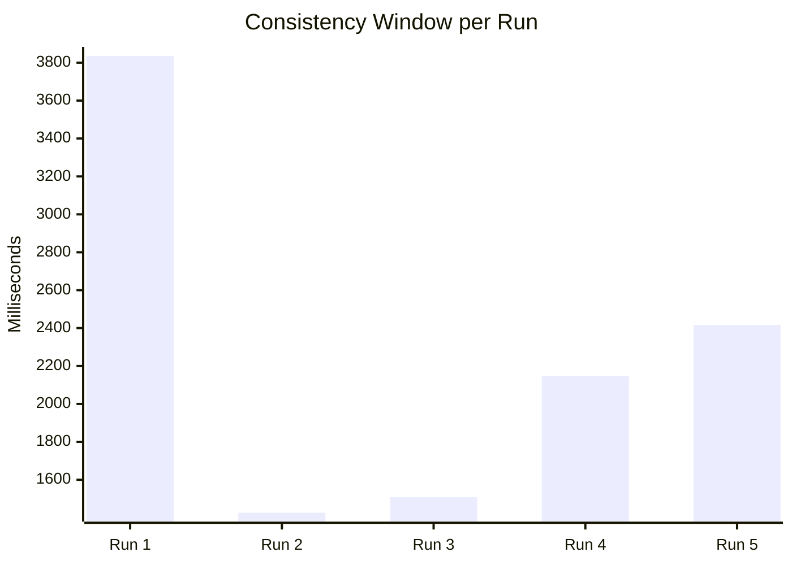
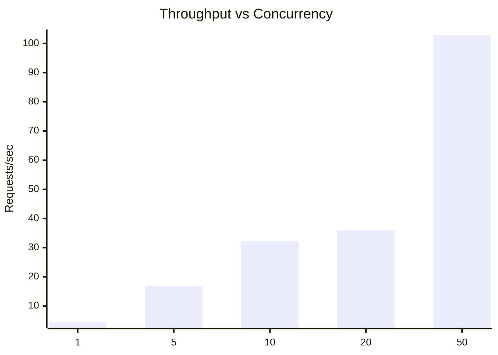
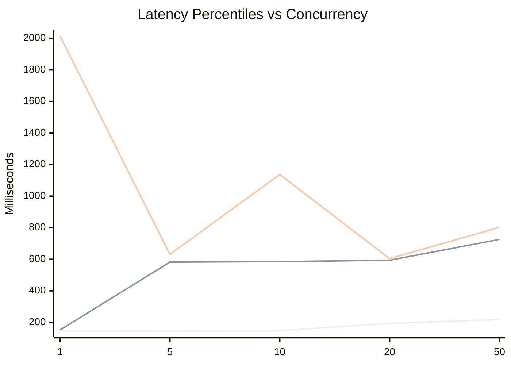
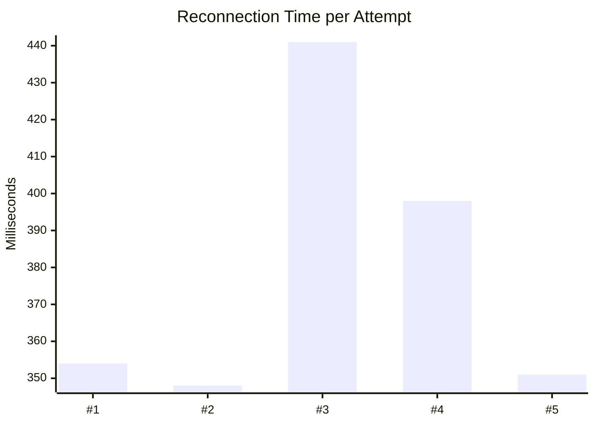
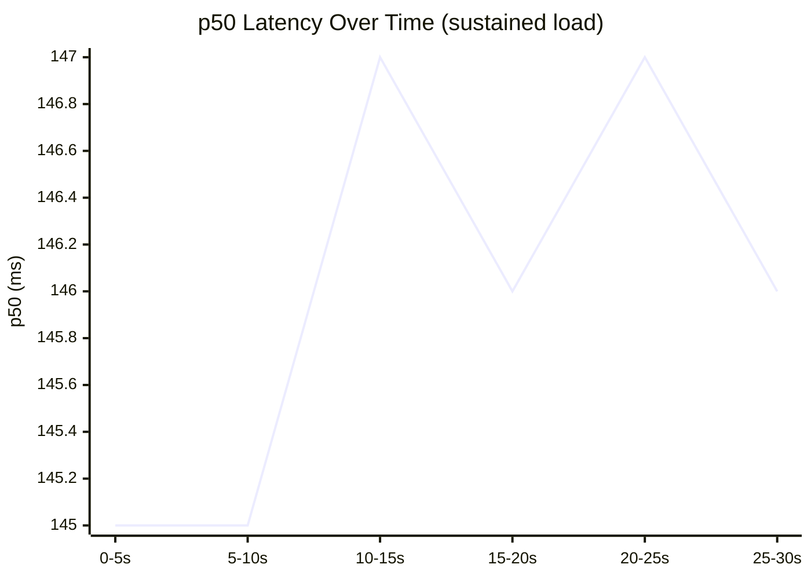

# Load Test Results

> Generated: 2026-04-27T08:19:24.147Z

## 1. Consistency Window Measurement

Measures the time from `GET /movies/:id` until the `stats_update` arrives over WebSocket.
This is the **eventual consistency window** of the system.

| Run | Consistency (ms) | HTTP Latency (ms) | E2E from publishedAt (ms) |
|-----|-----------------|-------------------|--------------------------|
| 1 | 3836 | 2340 | 2230 |
| 2 | 1426 | 151 | 1380 |
| 3 | 1508 | 161 | 1463 |
| 4 | 2147 | 589 | 2064 |
| 5 | 2417 | 591 | 2372 |

**Average consistency window: 2267ms** (min: 1426ms, max: 3836ms, successful: 5/5)



## 2. Burst Test — 100 Events

Sent **100** requests (concurrency=10) to movieId `573a13d3f29313caabd9473c`.

| Metric | Value |
|--------|-------|
| Requests sent | 100 |
| Successful publishes | 100 |
| Errors | 0 |
| Time to publish all | 5039ms |
| Final viewCount | 1484 |
| Stats updates received | 1 |
| Total convergence time | 10.0s |

```mermaid
xychart-beta
  title "viewCount Convergence Over Time"
  x-axis ["T+10.0s"]
  y-axis "viewCount" 0 --> 1484
  line [1484]
```

**Analysis:** SQS acts as a buffer between the fast producer (HTTP requests) and the slower consumer (Lambda batches of up to 10). Multiple Lambda instances process in parallel; DynamoDB atomic `ADD` prevents data races.

## 3. Throughput & Latency Under Variable Load

Requests per concurrency level: 50

| Concurrency | Throughput (r/s) | p50 (ms) | p95 (ms) | p99 (ms) | Errors |
|-------------|-----------------|----------|----------|----------|--------|
| 1 | 4.47 | 146 | 152 | 2014 | 10.0% |
| 5 | 16.96 | 144 | 582 | 631 | 24.0% |
| 10 | 32.21 | 147 | 585 | 1137 | 24.0% |
| 20 | 35.95 | 194 | 594 | 604 | 40.0% |
| 50 | 102.87 | 218 | 726 | 802 | 26.0% |





### End-to-End Latency (via WebSocket)

| Metric | Value |
|--------|-------|
| Samples | 32 |
| p50 | 1827ms |
| p95 | 2394ms |
| p99 | 3992ms |
| min | 1255ms |
| max | 3992ms |
| avg | 1902ms |

## 4. WebSocket Reconnection Behavior

Backoff: 1000ms × 2 (cap 30000ms)

| Attempt | Backoff (ms) | Connect Time (ms) | Result |
|---------|-------------|-------------------|--------|
| 1 | 1000 | 354 | ✓ |
| 2 | 2000 | 348 | ✓ |
| 3 | 4000 | 441 | ✓ |
| 4 | 8000 | 398 | ✓ |
| 5 | 16000 | 351 | ✓ |

**Average reconnect time: 378ms** (5/5 successful)



## 5. Lambda (Event Processor) Throughput

Measures events processed per second by polling DynamoDB viewCount during sustained load.
Target movieId: `573a13cff29313caabd88f5b`

| Target RPS | Events Sent | Processed | Time (s) | Avg Throughput (e/s) |
|------------|-------------|-----------|----------|---------------------|

```mermaid
xychart-beta
  title "Lambda Throughput vs Input Rate"
  x-axis []
  y-axis "Events/sec processed"
  bar []
```

## 6. Resilience

### 6a. Service A Decoupling (fire-and-forget SQS)

Verifies Service A response time is independent of downstream pipeline load.

| Condition | p50 (ms) | p95 (ms) |
|-----------|----------|----------|
| Baseline (sequential) | 147 | 2260 |
| Under load (20 concurrent) | 627 | 823 |

**Load/baseline p50 ratio: 4.3x** — ✓ Service A is decoupled from the pipeline

### 6b. WebSocket Gateway Independence

Gateway healthy when no events flowing: **✓ Yes**

### 6c. Sustained Load Stability (30s)

| Window | Requests | p50 (ms) | p95 (ms) | Errors |
|--------|----------|----------|----------|--------|
| 0-5s | 102 | 145 | 155 | 23 |
| 5-10s | 53 | 145 | 582 | 12 |
| 10-15s | 90 | 147 | 170 | 25 |
| 15-20s | 76 | 146 | 566 | 19 |
| 20-25s | 55 | 147 | 586 | 10 |
| 25-30s | 122 | 146 | 150 | 33 |

**Latency degradation (first→last p50): 1%** — ✓ Stable



### 6d. Graceful Degradation Under Overload

100 concurrent requests: **84 succeeded**, **16 failed** (16.0% error rate)
Latency: p50=938ms, p95=1317ms, p99=1320ms
SQS publisher: 134 published, 0 errors, avg latency 28.73134328358209ms
